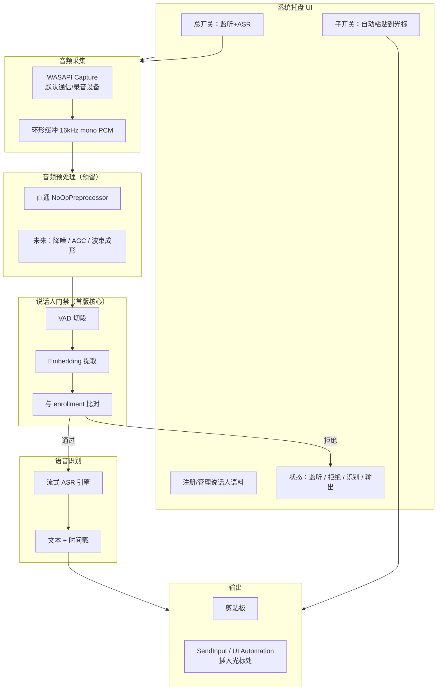

# Array Mic Refreshment

本地 Windows 后台常驻工具：持续监听系统音频输入，经**说话人门禁**过滤后做**语音识别（ASR）**，可选将文本写入剪贴板并插入当前光标位置。阵列麦已在硬件侧完成降噪/增益等预处理，本项目的音频增强模块仅预留扩展口，首版不实现。

---

## 产品目标（与你描述的对齐）

| # | 能力 | 首版 | 说明 |
|---|------|------|------|
| 1 | 后台常驻 + 托盘图标 | ✅ | 类似微信/QQ，开机可自启，托盘显示状态（监听中/门禁拒绝/ASR 中/已输出） |
| 2 | ASR（语音→文字） | ✅ | 实时性要求宽松（几十～上百 ms 级缓冲可接受），优先**本地**、可离线 |
| 3 | 音频预处理（降噪、AGC 等） | 🔌 预留 | 阵列麦已本地处理；软件侧留 `IAudioPreprocessor` 管道位，默认直通 |
| 4 | 说话人识别 / 门禁 | ✅ | 用户先录 enrollment 语料；运行时仅允许已注册说话人进入 ASR |
| 5 | 结果输出 + 双开关 | ✅ | 总开关：是否监听+ASR；子开关：是否自动复制并粘贴到光标；无光标则只进剪贴板（或不输出，可配置） |

---

## 总体架构



### 数据流（单条语音片段）

1. **WASAPI** 以固定帧率（如 20ms）写入环形缓冲。
2. **VAD** 检测语音起止，切出 0.5～3s 片段（可调）。
3. **Preprocessor**（首版直通）→ **Speaker Gate**：提取 embedding，与本地 enrollment 向量比对。
4. 分数 ≥ 阈值 → 同一片段送入 **ASR**；否则丢弃并更新托盘状态（可选短提示音）。
5. ASR 出字后：若**子开关**开 → 写剪贴板 + 尝试粘贴到焦点控件；否则仅内部缓冲或日志。

---

## 技术栈建议（供讨论）

### 宿主与 UI

| 方案 | 优点 | 缺点 | 建议 |
|------|------|------|------|
| **C# / .NET 8 + WinUI 3 或 WPF 托盘** | WASAPI、SendInput、单文件发布成熟；后台 Service + 托盘一体 | 需维护 C# | **推荐主路径** |
| Rust + tauri/tray | 性能好、二进制小 | 说话人/ASR 生态绑定成本高 | 备选 |
| Python + pystray | 原型快 | 打包大、托盘+低延迟音频弱 | 仅 PoC |

首版建议：**.NET 8 Worker / Windows Service + 独立 Tray 进程（或同进程 Hidden Window）**，用 `Microsoft.Toolkit.Uwp.Notifications` 或 `Hardcodet.NotifyIcon.Wpf` 做托盘。

### 音频采集

- **WASAPI**（`NAudio.Wasapi` 或 `CSCore`）：选默认录音设备；若未来要「只听某麦克风」，在设置里绑定 `IMMDevice` ID。
- 统一内部格式：**16 kHz, mono, 16-bit PCM**（与多数 ASR / 说话人模型一致）。
- 帧长：**20 ms**（320 samples），环形缓冲保留 3～5 s 供 VAD 回看。

### 说话人门禁（Speaker Verification）

目标：**1:N Enrollment（可多名注册用户）+ 运行时 1:1 比对**，拒绝旁人声音进入 ASR。

| 组件 | 候选 | 说明 |
|------|------|------|
| Embedding | **ECAPA-TDNN**（SpeechBrain 导出 ONNX）或 **sherpa-onnx speaker** | 192～512 维向量；enrollment 存 3～5 条片段的**均值向量** + 可选方差 |
| 推理 | **ONNX Runtime**（CPU EP；有核显可加 DirectML） | 与 ASR 栈统一 |
| 切段 | **WebRTC VAD** 或 **silero-vad**（ONNX） | 避免对静音算 embedding |
| 阈值 | 开发集标定 **EER** 点，默认 cosine ≥ 0.75（可调） | 托盘提供「敏感度」滑块映射阈值 |
| 抗欺骗 | 首版不做 deepfake 检测 | 进阶可加 ASVspoof 小模型 |

**Enrollment 流程（UX）**

1. 托盘 →「添加说话人」→ 提示朗读 3 句固定/随机文本（每句 2～4 s）。
2. 每句通过 VAD 切段 → embedding → 存 `%AppData%/ArrayMicRefreshment/enrollments/{userId}.json`（向量 + 元数据，**不上云**）。
3. 支持多 profile（本人、家人）但**同一时刻只启用一个「当前说话人」或 OR 逻辑通过任一 profile**（产品需二选一，见文末待决项）。

### ASR（重点讨论）

实时性要求不高，但希望**本地、稳定、中文友好**。下面按「流式体验 / 中文 / 部署体积」对比：

| 引擎 | 类型 | 中文 | 流式 | 典型延迟 | 体积 | 许可 |
|------|------|------|------|----------|------|------|
| **sherpa-onnx**（Paraformer / Zipformer） | 本地 ONNX | ✅ 官方多中文模型 | ✅ 流式 API | 100～300 ms 级 | 中（模型 20～200MB） | Apache 2.0 |
| **faster-whisper**（Whisper 量化） | 本地 | ✅ | ⚠ 偏段式，流式需 chunk 技巧 | 200 ms～数 s | 中～大 | MIT |
| **Vosk** | 本地 | ✅ 有中文模型 | ✅ | 较低 | 小 | Apache 2.0 |
| **FunASR**（阿里） | 本地/服务 | ✅✅ | ✅ | 中 | 较大 | 需看模型许可 |
| **Azure Speech** | 云 | ✅✅ | ✅ | 网络依赖 | 无本地模型 | 商业 |
| **Windows 内置语音识别** | 系统 | 依赖语言包 | ⚠ | 不透明 | 0 | 系统绑定 |

**首版推荐：sherpa-onnx 流式 Paraformer（中文 int8）**

- 与说话人模块同属 **k2-fsa** 生态，C API 完善，已有 **C# / Python** 绑定，Windows x64 预编译包可缩短工期。
- 接受「句子级」稳定输出：门禁通过后才送 ASR，天然是段式，与「几十～上百 ms」目标一致。
- **备选 A**：Vosk——更轻、集成简单，中文大词表场景准确率可能略逊 Paraformer。
- **备选 B**：faster-whisper `small`/`base` int8——若你更看重方言/噪声鲁棒且可接受略高延迟。

**不推荐首版上云**：与你强调的隐私、阵列麦本地处理理念一致；云 ASR 可作为设置里「实验性」后续选项。

### 音频预处理（预留，不实现）

```text
interface IAudioPreprocessor {
    void Process(ReadOnlySpan<short> input, Span<short> output);
}
```

- 默认：`NoOpPreprocessor`。
- 未来可插：RNNoise、webrtc-audio-processing（AGC/NS）、或阵列麦厂商 SDK。
- 配置项：`PreprocessorChain: []` 于 `appsettings.json`。

### 输出：剪贴板 + 光标插入

| 步骤 | API | 注意 |
|------|-----|------|
| 写剪贴板 | `Clipboard.SetText`（STA 线程） | 合并策略：见下「文本合并」 |
| 检测焦点 | `GetGUIThreadInfo` / `UI Automation` 找 `TextPattern` | 无光标 → 跳过粘贴 |
| 插入 | 优先 **`SendInput` 模拟 Ctrl+V**；备选 `TextPattern.Insert` | 部分 UWP 沙箱应用可能失败 → 托盘提示「仅已复制」 |

**双开关逻辑**

| 总开关 | 子开关 | 行为 |
|--------|--------|------|
| OFF | * | 不采集 / 或只采集不做 ASR（省电模式可选） |
| ON | OFF | 跑门禁+ASR，结果仅写日志或内部队列（调试用） |
| ON | ON | ASR 文本 → 剪贴板 → 若可聚焦则粘贴到光标 |

**文本合并策略（待讨论）**

- **A. 增量**：每个 VAD 段一条，直接追加粘贴（聊天场景像连续打字）。
- **B. 句末标点**：ASR 带标点模型，按句号换行再粘贴。
- **C. 防抖**：300 ms 内多段合并为一次剪贴板更新，减少频繁 Ctrl+V。

默认建议 **C + 段间空格**，避免 AI 聊天窗口刷屏。

---

## 仓库目录规划（实施时按此落盘）

```text
ArrayMicRefreshment/
├── src/
│   ├── ArrayMicRefreshment.App/          # 托盘、设置、Enrollment UI
│   ├── ArrayMicRefreshment.Core/         # 管道编排、开关、配置
│   ├── ArrayMicRefreshment.Audio/        # WASAPI、环形缓冲、VAD
│   ├── ArrayMicRefreshment.Speaker/      # Embedding、比对、enrollment 存储
│   ├── ArrayMicRefreshment.Asr/          # sherpa-onnx 封装
│   ├── ArrayMicRefreshment.Output/       # 剪贴板、光标注入
│   └── ArrayMicRefreshment.Service/      # 可选 Windows Service 宿主
├── models/                               # .gitignore 大文件；安装脚本下载
│   ├── asr-paraformer-zh-int8/
│   ├── speaker-ecapa-tdnn/
│   └── vad-silero/
├── docs/
│   ├── ARCHITECTURE.md
│   ├── ASR_COMPARISON.md
│   └── ENROLLMENT.md
├── scripts/
│   └── download-models.ps1
└── README.md
```

---

## 分阶段实施计划

### Phase 0 — 工程底座（约 1 个迭代）

- [ ] .NET 8 解决方案 + `global.json`
- [ ] 托盘图标：启动/退出、总开关、子开关、关于
- [ ] `appsettings.json`：设备 ID、阈值、模型路径、日志级别
- [ ] 日志：Serilog 文件滚动；托盘「打开日志目录」
- [ ] 安装包：单文件 `dotnet publish` + 可选 MSIX（开机自启）

**验收**：进程后台常驻，托盘可开关，无音频逻辑。

### Phase 1 — 音频采集与 VAD（约 1 迭代）

- [ ] WASAPI 采集 → 16k mono 环形缓冲
- [ ] Silero VAD（ONNX）切段，事件 `OnSpeechSegment(ReadOnlyMemory<short>)`
- [ ] `IAudioPreprocessor` 直通实现
- [ ] 托盘状态：电平条或「Speech / Silence」

**验收**：对着麦说话，日志里可见稳定语音段时长与能量。

### Phase 2 — 说话人门禁（约 1～2 迭代）

- [ ] Enrollment UI：录 3 句、预览波形、重录
- [ ] ECAPA（或 sherpa speaker）ONNX 推理 + cosine 比对
- [ ] 阈值标定页：显示当前分数 vs 阈值
- [ ] 事件：`OnSpeakerAccepted` / `OnSpeakerRejected`

**验收**：本人通过、旁人拒绝；误拒/误通在安静办公室可调阈值到可接受范围。

### Phase 3 — ASR 集成（约 1～2 迭代）

- [ ] 集成 sherpa-onnx 流式中文模型
- [ ] 仅 `OnSpeakerAccepted` 片段进入 ASR
- [ ] 文本事件 `OnTranscript(string text, bool isFinal)`
- [ ] 模型首次启动校验 + `download-models.ps1`

**验收**：连续说 5 句，日志中文本与语义基本一致；延迟主观可接受。

### Phase 4 — 输出与双开关（约 1 迭代）

- [ ] 剪贴板写入（STA）
- [ ] 焦点检测 + Ctrl+V 注入
- [ ] 总开关 / 子开关 与 Phase 0 托盘联动
- [ ] 无光标、沙箱应用降级策略

**验收**：记事本/微信/浏览器输入框可自动出现文字；子开关 OFF 时不粘贴。

### Phase 5 — 体验与发布（约 1 迭代）

- [ ] 开机自启、崩溃自恢复
- [ ] 设置页：设备选择、当前说话人 profile、敏感度
- [ ] 性能：CPU 占用、内存、模型懒加载
- [ ] 用户文档：Enrollment、隐私说明（本地处理、不上传）

**验收**：非开发用户按 README 可完成安装与使用。

### Phase 6+ — 进阶（不在首版）

- [ ] `IAudioPreprocessor`：RNNoise / WebRTC APM
- [ ] 多说话人 OR/AND 策略、会议模式
- [ ] 云 ASR 可选通道
- [ ] 热词、自定义词汇表（提升专有名词）
- [ ] 与特定 AI 客户端的深度集成（若未来开放 API）

---

## 关键接口（代码契约，便于并行开发）

```csharp
// 音频 → 段
interface ISpeechSegmentSource {
    event EventHandler<SpeechSegment> SegmentReady;
}

// 说话人门禁
interface ISpeakerGate {
    Task<SpeakerScore> VerifyAsync(SpeechSegment segment, CancellationToken ct);
    Task EnrollAsync(string profileId, IReadOnlyList<SpeechSegment> samples);
}

// ASR
interface IStreamingAsr {
    Task<string> RecognizeAsync(SpeechSegment segment, CancellationToken ct);
}

// 输出
interface ITranscriptSink {
    Task EmitAsync(string text, TranscriptOptions options);
}

record TranscriptOptions(bool CopyToClipboard, bool PasteAtCaret);
```

管道注册（首版）：

```csharp
segmentSource.SegmentReady += async seg => {
    if (!settings.MasterEnabled) return;
    if (!await speakerGate.VerifyAsync(seg)) return;
    var text = await asr.RecognizeAsync(seg);
    await sink.EmitAsync(text, new(settings.PasteEnabled, settings.PasteEnabled));
};
```

---

## 性能与资源（经验预估，待实测）

| 模块 | CPU（i7 级） | 内存 |
|------|----------------|------|
| WASAPI + VAD | < 5% | < 50 MB |
| Speaker ONNX | 脉冲 10～20% / 段 | +100 MB |
| sherpa Paraformer int8 | 15～30% 持续 | +200～400 MB |
| 合计 | 可接受笔记本后台 | ~500 MB 内 |

阵列麦已做前端处理，**不建议首版叠加重降噪**，以免伤害说话人 embedding 一致性。

---

## 风险与对策

| 风险 | 对策 |
|------|------|
| 旁人声音误通过 | 提高 enrollment 质量说明；阈值保守；显示实时分数 |
| 本人被拒 | 敏感度滑块；支持追加 enrollment 样本 |
| 某些应用无法粘贴 | 文档列出；保证剪贴板可用 |
| sherpa MT/MD 运行库冲突 | 统一用官方 Windows 预编译包或 Docker 构建脚本锁定 |
| 模型体积大 | 安装器按需下载；首包仅 VAD + 小 embedding |

---

## 需要你拍板的讨论点

1. **宿主语言**：是否同意 **C# / .NET 8** 作为首版？（若你更熟悉 Python，可改为 Python 核心 + 轻量 C# 托盘壳。）
2. **ASR 选型**：**sherpa-onnx Paraformer** vs **Vosk** vs **faster-whisper**——你更看重「中文准确率」还是「安装包体积」？
3. **多说话人策略**：家人也要用，是 **多个 profile 任一通过**，还是 **严格单人**？
4. **子开关 OFF 时**：ASR 结果仅日志，还是仍写剪贴板但不粘贴？
5. **文本合并**：增量粘贴 vs 防抖合并（默认建议防抖 300 ms）。
6. **隐私文案**：是否在托盘明确标注「音频与声纹均不出本机」？

---

## 本地开发（占位，Phase 0 后补全）

```powershell
# 克隆后
git clone <repo>
cd array-mic-refreshment
./scripts/download-models.ps1   # Phase 3 起可用
dotnet build
dotnet run --project src/ArrayMicRefreshment.App
```

---

## 许可与模型

- 代码：待定（建议 MIT）
- 第三方模型：遵循各自仓库（sherpa-onnx Apache 2.0、SpeechBrain 模型需查看 `model-card`）

---

## 文档索引

| 文档 | 内容 |
|------|------|
| 本文 | 产品定义、架构、技术选型、分阶段计划、待决项 |
| `docs/ASR_COMPARISON.md` | Phase 3 前展开各 ASR 实测表（待写） |
| `docs/ENROLLMENT.md` | 录 enrollment 最佳实践（待写） |

---

*当前仓库状态：规划与 README；代码骨架将在 Phase 0 启动。*
