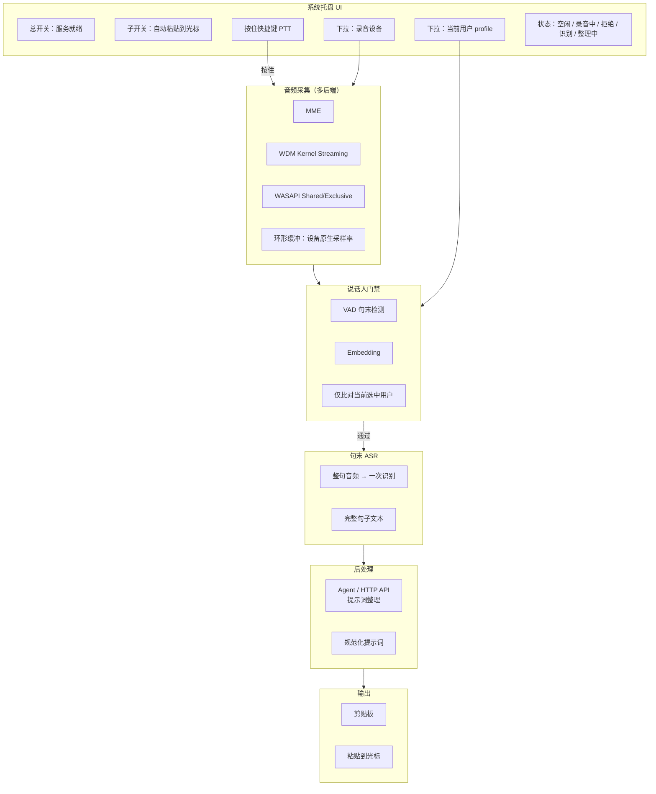

# Array Mic Refreshment

本地 Windows 后台常驻工具：在**按住指定快捷键（Push-to-Talk）**期间采集系统音频，经**当前选中用户的说话人门禁**过滤后做**句末模式 ASR**，再将文本交给 **Agent / API** 整理为更规范的提示词；可选写入剪贴板并插入光标。阵列麦已在硬件侧完成降噪/增益等预处理，软件侧音频增强仅预留扩展口，首版不实现。

---

## 产品目标（已对齐）

| # | 能力 | 首版 | 说明 |
|---|------|------|------|
| 1 | 后台常驻 + 托盘图标 | ✅ | 类似微信/QQ；托盘显示状态、当前用户、所选设备 |
| 2 | ASR（语音→文字） | ✅ | **句末模式**：一句结束再出完整文本，不做跟随式逐字显示 |
| 3 | 音频预处理 | 🔌 预留 | `IAudioPreprocessor` 默认直通 |
| 4 | 说话人门禁 | ✅ | **仅支持单人逻辑**：库内可存多个用户，**下拉菜单选择当前用户**；运行时只与当前用户 enrollment 比对 |
| 5 | 触发与输出 | ✅ | **按住快捷键**才跑采集→门禁→ASR→后处理；总开关控制服务是否就绪；子开关控制是否粘贴到光标 |
| 6 | Agent / 提示词整理 | ✅ 前期 API | ASR 整句 → HTTP API（后期可换本地 Agent）→ 输出整理后文本 |
| 7 | 音频设备 | ✅ | 设置页**选择设备**；默认跟随系统默认录音设备；协议 **MME / WDM / WASAPI** 均需覆盖 |
| 8 | 采样率 | ✅ | **跟随设备原生采样率**（48k 就 48k，16k 就 16k）；仅在送入模型前按需重采样 |

---

## 当前最先进的语音识别是什么？（2025–2026）

「最先进」没有唯一答案，取决于 **语言（中文 vs 英文）**、**流式 vs 离线**、**能否本地部署**、以及评测榜单。你记得的 **NVIDIA 近几个月的新模型** 确实存在，且英文场景非常强，但和本产品的中文本地场景要分开看。

### 你很可能指的是：NVIDIA Nemotron / Parakeet 系列

| 模型 | 发布时间（公开） | 特点 | 和本项目关系 |
|------|------------------|------|----------------|
| **Nemotron-ASR-Streaming**（`nemotron-speech-streaming-en-0.6b`） | 2026-03 量级 | 约 600M，Cache-Aware FastConformer-RNNT，**英文流式**，块延迟可配到 80～1120ms，带标点 | 英文 SOTA 梯队；**无官方中文主力型号** |
| **Parakeet-Unified-En-0.6b** | 2026-04 量级 | 同一模型兼顾离线与流式（最低约 160ms 块） | 同上，**英文** |
| **Parakeet-TDT / Parakeet-CTC 1.1B** | 2025 起 | HuggingFace OpenASR Leaderboard 英文前列 | 英文生产可选 |

结论：若问「**英文、流式、工业级、NVIDIA 最新**」——**Nemotron-ASR-Streaming / Parakeet-Unified** 就是 2026 年初 NVIDIA 主推的先进方案，可通过 **NIM、NeMo、HuggingFace** 部署，需 **GPU 或 NIM 服务** 才能发挥最佳体验。

### 中文 / 多语言开源第一梯队（更贴近本产品）

| 模型 | 亮点 | 本地 Windows |
|------|------|----------------|
| **Qwen3-ASR**（0.6B / 1.7B） | 52 语言、22 种中文方言；流式+离线统一；2026 社区 ONNX / **sherpa-onnx** 集成 | ✅ 可行，体积与算力高于 Paraformer |
| **FunASR / Paraformer**（阿里系） | 中文工业界常用，流式成熟 | ✅ 通过 sherpa-onnx |
| **MiMo-V2.5-ASR**（小米） | 中文方言、噪声、歌唱等场景 | ⚠ 需跟踪 ONNX 导出与许可 |
| **Cohere-transcribe**（2026-03） | OpenASR Leaderboard **英文** 领先 | 云端/API 导向为主 |

### 怎么理解「最先进」？

```text
英文 + NVIDIA GPU 生态     → Nemotron-ASR-Streaming / Parakeet-Unified（你说的「英伟达几个月前出的」）
中文 + 本地离线 + 方言      → Qwen3-ASR、FunASR/Paraformer（sherpa-onnx）
英文榜单 + 开源权重         → Cohere-transcribe、Parakeet-TDT
多语言（上千语种）          → Meta Omnilingual ASR（科研向，部署重）
```

**对本项目的建议（可继续讨论）：**

- **首版稳妥**：**sherpa-onnx + 中文 Paraformer/Zipformer int8**——延迟、体积、C# 绑定成熟。
- **追求中文准确率上限**：预留 **Qwen3-ASR-0.6B ONNX** 适配层（Phase 3+ 可切换 `IAsrEngine`）。
- **若你机器有 NVIDIA GPU 且主要说英文**：可另做实验分支接 **Nemotron-ASR-Streaming**（NeMo / NIM），与中文主路径分开维护。

「最先进」不等于「最适合本工具」：本工具要 **句末、按住说、本地隐私、中文**，应优先 **可离线、可换引擎、中文实测 WER/CER** ，而不是盲目追英文榜单第一。

---

## 总体架构（已更新）



### 数据流（按住快捷键期间）

1. 用户**按住 PTT 快捷键** → 开始从**所选设备**采集，采样率 = **设备当前格式**（如 48000 Hz stereo）。
2. 松开快捷键或 VAD 判定**句末** → 得到一整句 PCM（必要时在模型入口 **单独重采样** 到引擎要求，如 16 kHz mono）。
3. **说话人门禁**：仅与托盘下拉框选中的 **当前用户** enrollment 比对；旁人 → 拒绝，不进入 ASR。
4. **句末 ASR**：一次性识别整句，**不**做流式逐字上屏。
5. **Agent / API**：将 ASR 原文 POST 到配置的 endpoint，返回整理后的提示词（纠错、标点、结构化、去口语 filler）。
6. 若**子开关**开启 → 写剪贴板 + 有光标则粘贴；否则仅剪贴板或仅日志（可配置）。

---

## 已确认的产品决策

### 2. 单人逻辑 + 用户下拉

- 数据库可存 **多个用户 profile**（每人独立 enrollment）。
- **同一时刻只有一个「当前用户」**（托盘/设置页下拉选择）。
- 门禁 **只比对当前用户**，不做「家人任一通过」。
- 切换用户后，下一句按住 PTT 即按新用户声纹比对。

### 3. Push-to-Talk（PTT），无防抖

- **不再**使用「持续监听 + 防抖合并粘贴」。
- 映射一个 **全局快捷键**（可配置，如 `Ctrl+Alt+Space`）：**按住期间**才启用采集与后续管道；**松开**即结束本句采集并触发句末 ASR（若 VAD 已判句末可提前在按住过程中触发，以先到达者为准，实现细节 Phase 1 定稿）。
- 总开关 OFF 时：快捷键无效或仅提示「服务未就绪」。

### 4. 句末模式 + Agent / API 后处理

| 阶段 | 行为 |
|------|------|
| ASR | 一句完整文本，例如：`嗯那个我想查一下明天天气` |
| 后处理 | 调用 Agent 或前期 **HTTP API**（OpenAI-compatible / 自建 prompt） |
| 输出 | 例如：`查询明天天气预报`（规范、适合进 AI 聊天框的提示词） |

接口预留：

```csharp
interface IPromptRefiner {
    Task<string> RefineAsync(string rawTranscript, CancellationToken ct);
}
```

首版实现：`HttpPromptRefiner`（配置 `ApiEndpoint`、`ApiKey`、`SystemPrompt`）；后期可换 `LocalAgentRefiner`。

**不做**：流式字幕、逐 token 显示、边说边改剪贴板。

### 5. 音频设备选择 + 多协议

| 协议 | 角色 | 实现备注 |
|------|------|----------|
| **WASAPI** | 默认优先 | Shared 模式兼容性好；Exclusive 可选低延迟 |
| **WDM-KS** | 专业声卡 / 部分 USB 麦 | 通过 PortAudio 或专用封装访问 |
| **MME** | 老旧设备兼容 | 回退路径，延迟较高 |

- 设置页：**枚举设备列表** + 显示 API 类型 + 采样率/声道。
- 默认项：**系统默认录音设备**（`eCapture` default）。
- 切换设备时 **重新打开流**，读取该设备 `MixFormat`，**不强制改设备采样率**。

### 6. 模型分发：首次下载 vs 安装包内置

两种都**可信、可并存**，首版不阻塞开发：

| 方式 | 优点 | 缺点 | 可信度 |
|------|------|------|--------|
| **首次启动下载** | 安装包小；模型可独立升级；Git 仓库不含大文件 | 需网络；需校验 SHA256 | ✅ 高——业界常规（VS Code、Ollama、Whisper Desktop 同路） |
| **安装包内置** | 离线即用；无下载失败 | MSI/zip 体积 +200MB～1GB | ✅ 高——适合企业内网 |

**推荐实施顺序（降低风险）：**

1. Phase 0～2：仅小模型（VAD + Speaker embedding）可内置或首次下载。
2. Phase 3：ASR 默认 **首次启动引导 + `scripts/download-models.ps1`**，配置里写死 `ModelManifest`（URL + hash + 版本）。
3. Phase 5：再做安装器选项 **「完整包 / 在线包」** 二选一。

这样 **6 不是「以后再说不靠谱」**，而是 **先在线、后打包** 的成熟节奏；你两种都接受，工程上完全成立。

### 7. 采样率跟随设备

- 采集链路：**保持设备原生格式**（如 48000 Hz、2 ch、float 或 PCM）。
- 环形缓冲、电平表、VAD：在原生率上工作或内部按需下混到 mono，**不修改设备驱动格式**。
- **仅**在调用 ONNX ASR / Speaker 模型前，若模型要求 16 kHz mono，在内存中 **resample**（如用 `SpeexDSP` / `SoX` / `NAudio.WaveFormatConversionStream`）。
- 配置项记录：`DeviceSampleRate`、`DeviceChannels`、`ProcessingSampleRate`（模型侧）。

好处：避免系统重采样劣化；阵列麦若固定 48k 立体声，原样保留。

### 8. 「隐私文案」与「出网」到底指什么？

**隐私文案** = 界面上用大白话写清：**哪些数据会离开你的电脑（出网）**，哪些不会。避免笼统说「完全离线」而实际又在调云端 API。

#### 什么叫「出网」？

**出网** = 数据从你的 PC 经互联网发到**本机以外的服务器**（公网 API、厂商云、他人搭的反向代理等）。

| 数据 | 典型路径 | 是否出网 |
|------|----------|----------|
| 麦克风 **原始音频** | 仅本机缓冲 → 本机 ASR / 声纹 | ❌ 不出网 |
| **声纹 enrollment** | 仅存 `%AppData%` 等本地文件 | ❌ 不出网 |
| **ASR 得到的文字** | 若只做本地整理、不写剪贴板到云 | ❌ 不出网（全程本机） |
| **ASR 或整理后的文字** | `HttpPromptRefiner` → 你配置的 `https://...` API | ✅ **出网**（文字会上传） |
| **整理后的文字** | 发到 **本机** Ollama / `127.0.0.1` | ⚠️ 不经公网，但仍是「离开本进程发到另一服务」；文案可写「仅在本机网络处理，不上传至互联网」 |

因此：**发给 API 之后，文字就是出网了**——之前 README 里「不能写所有数据不出网」的意思正是这个，不是说不算算出网。

#### 推荐对用户怎么说（分两档）

**未启用「提示词整理 / API」时：**

> 录音与声纹仅在本机处理；识别文字默认也不上传。

**启用云端 API 整理时（必须明确写出网）：**

> 麦克风录音与声纹模板不会上传。**识别后的文字会经互联网发送到您自行配置的 API 地址**（由该服务商按其隐私政策处理）。请仅填写您信任的服务地址。

**启用本机 Ollama 等时：**

> 文字仅发送到本机地址（如 `http://127.0.0.1:11434`），不上传至公网。

#### 产品上的建议

- 设置里 **「提示词整理」默认关闭**；打开云端 API 时 **弹窗确认一次**。
- 关于页固定两段：**本机音频与声纹** / **文字是否出网（关 / 云端 API / 本机 Agent）**。
- 托盘可选「ℹ 数据说明」，不必长期占一行。

---

## 技术栈建议（更新）

### 宿主与 UI

首版仍建议 **C# / .NET 8** + 托盘 + 全局热键（`RegisterHotKey` / 低级键盘钩子实现「按住」检测）。

### 音频采集（多后端 + 原生采样率）

```text
IAudioCaptureBackend
├── WasapiCaptureBackend      // 默认
├── WdmKsCaptureBackend       // WDM
└── MmeCaptureBackend         // 回退

IAudioFormatConverter         // 仅在模型边界 resample / downmix
```

推荐库：**NAudio**（WASAPI、MME）+ 必要时 **PortAudio** 或 CSCore 补 WDM。

### 说话人门禁

- 仍为 **ECAPA-TDNN ONNX** + 当前用户 embedding 比对。
- Enrollment：每用户 3 句，存 `%AppData%/ArrayMicRefreshment/enrollments/{userId}.json`。
- UI：**用户下拉** +「管理用户」对话框（增删改、重录）。

### ASR（句末）

- 首版引擎接口：`IUtteranceAsr.RecognizeUtteranceAsync(PcmUtterance)`。
- 默认实现：**sherpa-onnx Paraformer**（句末一次推理）。
- 备选/进阶：**Qwen3-ASR ONNX**、实验性 **NVIDIA Nemotron**（英文 + GPU）。

### 输出

- 后处理后的文本 → 剪贴板；子开关 ON → 光标粘贴。
- **无防抖**；一次 PTT 会话可产出 0～N 句（每句一次 API 调用，可配置合并策略仅针对 API 侧）。

---

## 双开关 + PTT（逻辑表）

| 总开关 | PTT | 子开关 | 行为 |
|--------|-----|--------|------|
| OFF | * | * | 不处理 |
| ON | 未按住 | * | 空闲，不采集 |
| ON | 按住 | * | 采集 → 门禁 → 句末 ASR → API 整理 |
| ON | 按住→松开 | OFF | 整理结果仅日志 / 内部 |
| ON | 按住→松开 | ON | 整理结果 → 剪贴板 → 尝试粘贴 |

---

## 仓库目录规划

```text
ArrayMicRefreshment/
├── src/
│   ├── ArrayMicRefreshment.App/          # 托盘、PTT 热键、用户/设备下拉
│   ├── ArrayMicRefreshment.Core/         # 管道、开关、配置
│   ├── ArrayMicRefreshment.Audio/        # MME/WDM/WASAPI、原生采样率、resample
│   ├── ArrayMicRefreshment.Speaker/      # 当前用户门禁
│   ├── ArrayMicRefreshment.Asr/          # 句末 ASR 引擎抽象
│   ├── ArrayMicRefreshment.Prompt/       # Agent / HTTP API 整理
│   └── ArrayMicRefreshment.Output/       # 剪贴板、光标
├── models/                               # manifest；大文件不进 git
├── docs/
│   ├── ASR_SOTA.md                       # 先进 ASR 对比（可从此 README 拆出）
│   └── PRIVACY_COPY.md                   # 隐私文案定稿
└── scripts/
    └── download-models.ps1
```

---

## 分阶段实施计划（修订）

### Phase 0 — 工程底座

- [ ] .NET 8 解决方案、托盘、**总开关 / 子开关**
- [ ] **全局 PTT 热键**（按住/松开事件）
- [ ] **用户下拉**（占位数据）+ **设备下拉**（占位）
- [ ] `appsettings.json`：API endpoint、热键、当前 userId、deviceId

### Phase 1 — 音频采集

- [ ] WASAPI + MME + WDM 枚举与打开
- [ ] **原生采样率**采集、电平显示
- [ ] PTT 按住期间缓冲；松开 + VAD **句末** → `UtteranceReady`
- [ ] 模型边界 `ResampleTo16kMono()`（仅内部）

### Phase 2 — 说话人门禁

- [ ] 多用户 enrollment 管理 UI
- [ ] **仅当前选中用户** 比对
- [ ] 拒绝时托盘提示

### Phase 3 — 句末 ASR

- [ ] sherpa-onnx 句末识别
- [ ] `ModelManifest` 首次下载 + 校验（**6：在线优先**）
- [ ] 引擎抽象，文档记录 Qwen3 / Nemotron 切换路径

### Phase 4 — Prompt API + 输出

- [ ] `HttpPromptRefiner`
- [ ] 子开关 → 剪贴板 / 粘贴
- [ ] API 首次启用**隐私确认**（见第 8 节）

### Phase 5 — 发布

- [ ] 安装包可选「完整内置模型」
- [ ] 关于页隐私文案定稿

---

## 关键接口（修订）

```csharp
interface IPushToTalkSource {
    event EventHandler PttPressed;
    event EventHandler PttReleased;
}

interface IUtteranceAsr {
    Task<string> RecognizeUtteranceAsync(AudioUtterance utterance, CancellationToken ct);
}

interface IPromptRefiner {
    Task<string> RefineAsync(string rawTranscript, CancellationToken ct);
}

// 管道（简化）
ptt.PttReleased += async () => {
    if (!settings.MasterEnabled) return;
    var utterance = await audio.CollectUtteranceAsync();
    if (!await speakerGate.VerifyCurrentUserAsync(utterance)) return;
    var raw = await asr.RecognizeUtteranceAsync(utterance);
    var refined = await promptRefiner.RefineAsync(raw);
    await sink.EmitAsync(refined, settings.PasteEnabled);
};
```

---

## 待讨论（剩余）

1. **宿主语言**：是否确认 C# / .NET 8？
2. **ASR 首版默认**：Paraformer vs 直接上 **Qwen3-ASR-0.6B**（更准确 vs 更吃资源）？
3. **PTT 松开与句末**：以「松开」为准还是以「VAD 句末」为准，或二者取先？
4. **API 整理**：默认用哪家（OpenAI-compatible / 本地 Ollama）？系统 prompt 是否内置模板？
5. **子开关 OFF**：整理后的文本是否仍写剪贴板？

---

## 本地开发（占位）

```powershell
git clone <repo>
cd array-mic-refreshment
./scripts/download-models.ps1
dotnet build
dotnet run --project src/ArrayMicRefreshment.App
```

---

## 文档索引

| 文档 | 内容 |
|------|------|
| 本文 | 架构、ASR 现状、PTT、句末、设备、采样率、隐私、模型分发 |
| `docs/ASR_SOTA.md` | 可选：Nemotron / Qwen3 / Paraformer 实测对比 |
| `docs/PRIVACY_COPY.md` | 可选：面向用户的隐私说明定稿 |

---

*当前仓库状态：规划与 README；代码骨架待 Phase 0 启动。*
