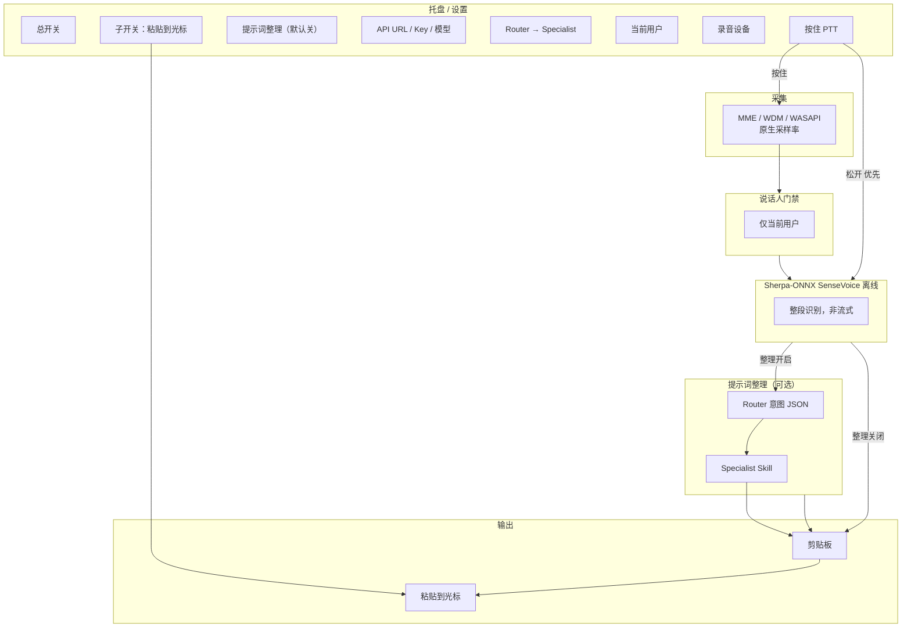

# Array Mic Refreshment

**当前版本：V0.3**

本地 Windows 后台常驻工具：**C# + Sherpa-ONNX + SenseVoice**。按住 **PTT** 采集 → **当前用户** 门禁 → **离线句末 ASR** → 可选 **LLM 整理**（纯文本润色或多 Skill 意图改写）→ 剪贴板 / 光标粘贴。

阵列麦已在硬件侧完成降噪/增益；软件侧 `IAudioPreprocessor` 仅预留，首版不实现。

---

## 已定稿技术决策（综合版）

| # | 决策 | 说明 |
|---|------|------|
| 1 | **C# / .NET 8 + Sherpa-ONNX** | 宿主与推理栈确定；通过 Sherpa-ONNX C API / 官方 C# 示例封装 P/Invoke |
| 2 | **ASR：SenseVoice int8（已定）** | Sherpa-ONNX **离线** SenseVoice；松开 PTT 整段识别；详见 [`docs/ASR_MODEL.md`](docs/ASR_MODEL.md) |
| 3 | **首版即含 LLM 提示词整理，默认关闭** | 设置项「启用提示词整理」默认 **关**；打开后才调用户配置的 API |
| 4 | **Agent 开启时，剪贴板只放优化句** | 不写 ASR 原文；优化失败时可配置降级策略（见输出逻辑） |
| 5 | **松开 PTT 优先触发 ASR** | **松开快捷键** 立即截断并识别，优先级 **高于** VAD 句末；按住期间 VAD 句末仅作辅助（长句中间停顿） |
| 6 | **子开关 OFF：仍写剪贴板** | 子开关只控制 **是否自动粘贴到光标**；OFF = 不粘贴，**仍更新剪贴板** |
| 7 | **API + 他人 Skill/Prompt 栈** | 意图来自 [voice-controlled-ai-agent](https://github.com/shanttoosh/voice-controlled-ai-agent)；整理栈来自 [danielrosehill](https://github.com/danielrosehill/Speech-Tech-Index) 等（[`skills/manifest.yaml`](skills/manifest.yaml)） |
| 8 | **Qwen3-ASR** | **首版不做**；仅文档保留对比，见 [SenseVoice vs Qwen3](#sensevoice-和-qwen3-asr-哪个好) |

---

## 产品目标

| # | 能力 | 首版 |
|---|------|------|
| 1 | 托盘常驻、设置窗（设备/用户/API/预设） | ✅ |
| 2 | PTT + 离线句末 ASR（SenseVoice） | ✅ |
| 3 | 说话人门禁（当前用户） | ✅ |
| 4 | LLM 多 Skill 整理（可选，默认关） | ✅ |
| 5 | 剪贴板 + 子开关控制粘贴 | ✅ |
| 6 | 设备可选，MME / WDM / WASAPI | ✅ |
| 7 | 采样率跟随设备，模型边界再 resample | ✅ |
| 8 | 音频预处理 | 🔌 预留 |

---

## 总体架构



### 触发与识别（PTT 优先级）

```text
按住 PTT  → 开始写入缓冲（设备原生采样率）
松开 PTT  → 【立即】结束本段、跑门禁 → SenseVoice 离线识别  （优先级最高）
按住期间  → VAD 可选判句末，仅用于「未松开时的中间切段」；不与松开抢触发权
```

### 输出逻辑（剪贴板 / 粘贴 / Agent）

| 提示词整理 | 子开关（粘贴） | 剪贴板内容 | 光标粘贴 |
|------------|----------------|------------|----------|
| OFF | OFF | ASR 原文 | 否 |
| OFF | ON | ASR 原文 | 是（有焦点时） |
| ON | OFF | **仅优化句** | 否 |
| ON | ON | **仅优化句** | 是 |

- **Agent 开启时绝不把 ASR 原文写入剪贴板**（调试日志可保留原文，默认不展示给用户）。
- 整理 API 失败：可配置 `OnRefineFailure: UseRawTranscript | ShowError | KeepLast`（首版建议 `UseRawTranscript` 并托盘提示）。

---

## 技术栈（确定）

| 层级 | 选型 |
|------|------|
| 语言 / UI | **C# / .NET 8**，托盘 + 设置窗 |
| ASR | **Sherpa-ONNX** → **SenseVoice 离线**（`OfflineRecognizer`） |
| 说话人 | ECAPA-TDNN ONNX（或 sherpa speaker） |
| VAD | Silero VAD（辅助，非主触发） |
| 音频 | NAudio + MME / WDM / WASAPI；边界 resample → 16 kHz mono（SenseVoice 要求） |
| 提示词整理 | 任意 **OpenAI-compatible** HTTP API；**内置 Skill** 驱动 system prompt |

### SenseVoice 模型（Sherpa-ONNX 预训练）

首版建议下载（manifest 指向官方 release）：

| 模型 ID | 说明 | 体积量级 |
|---------|------|----------|
| `sherpa-onnx-sense-voice-zh-en-ja-ko-yue-int8-2025-09-09` | 较新 int8，中英日韩粤 | ~230 MB |
| `sherpa-onnx-sense-voice-zh-en-ja-ko-yue-int8-2024-07-17` | 上一版 int8，作回退 | ~230 MB |

- **推理方式**：`OfflineRecognizer`，一次送入松开 PTT 后的整段 PCM。
- **非流式**：符合产品要求；延迟 = 段长 + 推理时间（段长短时通常可接受）。
- **输出注意**：SenseVoice 可能带情感/事件等标签字段，管道中需 **只取文本行** 或按 Sherpa API 关闭富文本标签（实现时对照 C# 示例）。

---

## LLM 提示词整理（首版即有，默认关）

### 设置界面（API 配置窗）

- **LLM 预设 ×3**：可分别保存名称、API Base URL、Key、Model，一键切换（如本地 Ollama / DeepSeek / OpenAI）
- **API Base URL**（如 `https://api.openai.com/v1`、`https://api.deepseek.com/v1`、本机 `http://127.0.0.1:11434/v1`）
- **API Key**（本机 Ollama 可空）
- **Model**（如 `gpt-4o-mini`、`deepseek-chat`）
- **启用提示词整理**（checkbox，**默认不勾选**）
- **整理风格**：自动 / **纯文本整理** / 编程·通用·调研·待办
- **测试连接**：在设置内验证 API 是否可用
- **Skills 目录**：默认 `skills/`（一般无需改）

### 多 Skill 协同（**仅用他人 prompt**，见 `skills/upstream/`）

```text
ASR 原文
  → ① shanttoosh/voice-controlled-ai-agent 意图分类 prompt（JSON）
  → manifest.yaml 映射 → specialist
  → ② 拼接 danielrosehill 等上游 prompt 栈（STT cleanup + 场景 prompt）
  → 剪贴板
```

| specialist | 他人作品（manifest 中 stack） |
|------------|-------------------------------|
| `code-editing` | STT-Basic-Cleanup + Voice-Prompt-Enhancement-Node + [code-editing.md](https://github.com/danielrosehill/Text-Transformation-Prompt-Collection-2/blob/main/by-use-case/ai/development/code-editing.md) |
| `general-ai` | STT-Basic-Cleanup + [general-prompt.md](https://github.com/danielrosehill/Text-Transformation-Prompt-Collection-2/blob/main/by-use-case/ai/general-prompt.md) |
| `research` | STT-Basic-Cleanup + [deep-research-prompt.md](https://github.com/danielrosehill/Text-Transformation-Prompt-Collection-2/blob/main/by-use-case/ai/deep-research-prompt.md) |
| `task-plan` | STT-Basic-Cleanup + [to-do-list.md](https://github.com/danielrosehill/Text-Transformation-Prompt-Collection-2/blob/main/by-use-case/to-do-list.md) |

| 文档 / 脚本 | 说明 |
|-------------|------|
| [`skills/manifest.yaml`](skills/manifest.yaml) | 路径与 intent 映射（**无自写正文**） |
| [`skills/upstream/`](skills/upstream/) | 第三方原文副本 |
| [`scripts/sync-upstream-skills.sh`](scripts/sync-upstream-skills.sh) | 从 GitHub 同步上游 |
| [`docs/SKILL_PIPELINE.md`](docs/SKILL_PIPELINE.md) | 管线说明 |

可选完整 Skill：[voice-refine](https://github.com/FlorianBruniaux/claude-code-ultimate-guide/blob/main/examples/skills/voice-refine/SKILL.md)、[dictation-githubnext-gh-aw-2](https://github.com/majiayu000/claude-skill-registry/blob/main/skills/other/dictation-githubnext-gh-aw-2/SKILL.md)（见 manifest `optional_skills`）。

### 隐私（与出网）

- **音频、声纹**：不出网。
- **启用整理且 URL 为公网**：**文字出网**；首次开启须确认。
- **URL 为 127.0.0.1**：文字不出公网，仅本机服务。

---

## SenseVoice 和 Qwen3-ASR 哪个好？

**已定：首版只用 SenseVoice int8**（[`docs/ASR_MODEL.md`](docs/ASR_MODEL.md)）。下表供日后是否要加 Qwen3 时参考。

| 维度 | SenseVoice int8 ✅ 首版 | Qwen3-ASR-0.6B int8（后续可选） |
|------|------------------------|----------------------------------|
| 准确率 | 很好 | 普通话通常 **更好** |
| 速度 / CPU | **快** | 更慢 |
| 体积 | ~230 MB | 更大 |
| 与 PTT 短句 | **已选** | 准度换延迟 |

Qwen3 在公开基准上 CER 常更低，但首版不集成第二套模型；若实测 SenseVoice 对代码术语错误太多，再通过 `IUtteranceAsr` 增加 Qwen3 工厂。Phase 5 本地 CER 实测（[`docs/CER_BASELINE.md`](docs/CER_BASELINE.md)）显示代码/英文混合术语子集均值 **>25%**，建议优先评估 Qwen3-ASR 作为补充引擎。

**LLM Skill 不能替代 ASR**：`ApiService`、`async` 等听错需靠 ASR 或重说；Skill 负责改成清晰 **代码编辑指令**。

---

## 音频与设备

- **协议**：WASAPI（默认）、WDM、MME 均需枚举与打开。
- **设备**：设置页下拉；默认 **系统默认录音设备**。
- **采样率**：跟随设备（48k/16k 等）；仅在送入 SenseVoice / 声纹模型前 **resample 16 kHz mono**。

---

## 模型分发

- Phase 3 起：`download-models.ps1` + `ModelManifest`（URL、SHA256）。
- 安装包「内置 / 在线下载」后期再做，不阻塞首版。

---

## 仓库目录规划

```text
ArrayMicRefreshment/
├── src/
│   ├── ArrayMicRefreshment.App/       # 托盘、设置窗、PTT
│   ├── ArrayMicRefreshment.Core/
│   ├── ArrayMicRefreshment.Audio/
│   ├── ArrayMicRefreshment.Speaker/
│   ├── ArrayMicRefreshment.Asr/       # SenseVoiceAsr（Sherpa OfflineRecognizer）
│   ├── ArrayMicRefreshment.Prompt/    # Router + Specialist Skills
│   └── ArrayMicRefreshment.Output/
├── skills/
│   ├── manifest.yaml                  # 仅映射，无自写 prompt
│   └── upstream/                      # 第三方 prompt 原文副本
├── scripts/
│   ├── download-models.ps1
│   └── sync-upstream-skills.sh
├── models/                            # gitignore
└── README.md
```

---

## 分阶段实施计划

### Phase 0 — 底座

- [x] .NET 8 解决方案、Sherpa native dll 部署说明（见 [`docs/DEPLOY_SHERPA.md`](docs/DEPLOY_SHERPA.md)）
- [x] 托盘：总开关、子开关（PTT 热键配置项；全局热键 Phase 1）
- [x] 设置窗：API URL / Key / Model、**整理默认关**、Skill 路径
- [x] `scripts/download-models.ps1` + [`scripts/ModelManifest.json`](scripts/ModelManifest.json)

### Phase 1 — 音频

- [x] MME / WDM / WASAPI、设备下拉、原生采样率（`IAudioDeviceEnumerator` / `NAudioDeviceEnumerator`；设置窗「录音设备」ComboBox）
- [x] PTT 全局热键 + 松开 **优先** 截断；VAD 辅助（`PttCaptureService` / `SileroVoiceActivityDetector` hook）

### Phase 2 — 说话人

- [x] 多用户 enrollment + 当前用户下拉（`EnrollmentDialog` / 设置窗「当前用户」）

### Phase 3 — SenseVoice ASR（仅此引擎）

- [ ] `OfflineRecognizer` + **仅** SenseVoice int8 2025-09（fallback 2024-07）
- [ ] `SenseVoiceAsr` + 纯文本抽取（去掉情感标签等）
- [ ] `ModelManifest` / `download-models.ps1` 仅 SenseVoice

### Phase 4 — 上游 Prompt 栈 + 输出

- [ ] 读 `skills/manifest.yaml`，拼接 `skills/upstream/*`
- [ ] `IntentRouter`（shanttoosh 分类 prompt）+ `PromptRefiner`（danielrosehill stack）
- [ ] 设置：自动 / 强制意图；可选 voice-refine / dictation Skill
- [x] 隐私确认弹窗（`PrivacyConfirmation` + 设置窗 OK / 启用整理时确认）

### Phase 5 — 发布

- [x] 模型下载 / 可选完整包（`scripts/download-models.ps1`；见 [`docs/DEPLOY_SHERPA.md`](docs/DEPLOY_SHERPA.md)）
- [x] 实机记录：代码术语 ASR 错误率 — [`docs/CER_BASELINE.md`](docs/CER_BASELINE.md)（均值 CER ~72% on TTS prompts；代码术语子集 >25%，建议评估 Qwen3-ASR）
- Demo 视频：[`docs/demos/demo_tray_basic.mp4`](docs/demos/demo_tray_basic.mp4)、[`demo_ptt_asr.mp4`](docs/demos/demo_ptt_asr.mp4)、[`demo_refine.mp4`](docs/demos/demo_refine.mp4)、[`demo_enrollment.mp4`](docs/demos/demo_enrollment.mp4)（部分为自动化 smoke 幻灯片，见 [`docs/HANDOFF_PHASE5_BLOCKERS.md`](docs/HANDOFF_PHASE5_BLOCKERS.md)）

*Phase 5 收尾验证由本地 agent 在 Windows 上完成；demo 视频在 docs/demos/，CER 评估在 docs/CER_BASELINE.md。*

---

## 关键接口

```csharp
interface IPushToTalkSource {
    event EventHandler PttPressed;
    event EventHandler PttReleased;  // 松开 → 立即触发识别管道
}

interface IUtteranceAsr {
    Task<string> RecognizeUtteranceAsync(AudioUtterance utterance, CancellationToken ct);
}

enum PromptIntent { Auto, CodeEditing, GeneralAi, Research, TaskPlan }

interface IIntentRouter {
    Task<(PromptIntent Intent, float Confidence)> RouteAsync(string raw, CancellationToken ct);
}

interface IPromptRefiner {
    bool IsEnabled { get; }
    Task<string> RefineAsync(string raw, PromptIntent intent, CancellationToken ct);
}

interface ITranscriptSink {
    Task EmitAsync(string textToClipboard, bool pasteToCaret);
}

// 管道
ptt.PttReleased += async () => {
    if (!settings.MasterEnabled) return;
    var utterance = await audio.FinalizeOnReleaseAsync();
    if (!await speakerGate.VerifyCurrentUserAsync(utterance)) return;

    var raw = await asr.RecognizeUtteranceAsync(utterance);

    string output = raw;
    if (settings.PromptRefineEnabled) {
        var intent = settings.ForcedIntent
            ?? (await router.RouteAsync(raw, CancellationToken.None)).Intent;
        output = await promptRefiner.RefineAsync(raw, intent, CancellationToken.None);
    }

    await sink.EmitAsync(output, pasteToCaret: settings.PasteToCaretEnabled);
};
```

---

## 先进 ASR 参考（英文 / 研究向）

| 模型 | 场景 |
|------|------|
| NVIDIA Nemotron-ASR-Streaming | 英文流式工业级 |
| Cohere-transcribe | 英文榜单 |
| Qwen3-ASR | 中文极致准 + 方言 |

与本项目默认路径 **无冲突**：它们列在此处仅供日后 `IUtteranceAsr` 扩展，**首版不实现**。

---

## 安装与使用（普通用户）

### 方式 A：完整离线包（推荐，含全部模型）

本地构建产出（约 2.7 GB 压缩包）：

```text
dist\ArrayMicRefreshment-ready.zip
```

解压后目录需同时包含 `ArrayMicRefreshment.exe`、`models\`、`skills\`。双击 exe，托盘图标出现后：

1. 右键托盘 → **设置**
2. 可选：勾选「启用提示词整理」→ 选择 LLM 预设 → 填写 API → **测试连接** → **确定**
3. 按住 PTT 热键（默认 `Ctrl+Alt+Space`，可在设置中改）说话，松开即识别

### 方式 B：GitHub Releases（小包 + 自行下载模型）

1. 打开 [Releases](https://github.com/wangyuanzhong/array-mic-refreshment/releases)，下载：
   - `ArrayMicRefreshment-framework-dep.zip`（需 [.NET 8 Desktop Runtime](https://dotnet.microsoft.com/download/dotnet/8.0)）
   - 或 `ArrayMicRefreshment-self-contained.zip`（自带运行时）
2. 解压后在目录内运行：
   ```powershell
   .\scripts\download-models.ps1 -Package all -IncludeSpeaker
   ```
3. 双击 `ArrayMicRefreshment.exe` 使用

## 本地编译 .exe（开发者 / 自己打包）

```powershell
git clone https://github.com/wangyuanzhong/array-mic-refreshment.git
cd array-mic-refreshment
.\scripts\download-models.ps1
.\scripts\build-release.ps1 -Mode self-contained -IncludeModels -Zip
# 产出：dist\ArrayMicRefreshment-self-contained\（含 models、skills）
# 完整离线包可再打包为 dist\ArrayMicRefreshment-ready.zip（见 CHANGELOG.md）
```

参数：
- `-Mode framework-dep`（默认）：小包，目标机器需 .NET 8 Desktop Runtime
- `-Mode self-contained`：自带运行时，~150 MB，开箱可跑
- `-Zip`：额外打 zip

或者 dev 直接跑（不打包）：

```powershell
dotnet build ArrayMicRefreshment.sln -c Release
dotnet run --project src\ArrayMicRefreshment.App -c Release
```

**Linux / CI（类库 + 单元测试，不含 WinForms App）**

```bash
dotnet restore ArrayMicRefreshment.CI.slnf
./scripts/build-libraries.sh
dotnet test tests/ArrayMicRefreshment.Core.Tests -c Release
dotnet test tests/ArrayMicRefreshment.Audio.Tests -c Release
```

- `ArrayMicRefreshment.Audio` 为多目标：`net8.0`（Linux CI 占位桩 + 跨平台逻辑）与 `net8.0-windows`（NAudio 采集 / 全局 PTT / Silero VAD hook）。
- Linux 上 **不会** 构建 `ArrayMicRefreshment.App`（WinForms 托盘）；Windows 实机请用完整 `ArrayMicRefreshment.sln`。
- 音频相关单元测试在 `tests/ArrayMicRefreshment.Audio.Tests`（热键解析、resample、PTT 优先级；使用 `FakeCaptureStream`，不依赖声卡）。

GitHub Actions：见 [`.github/workflows/ci.yml`](.github/workflows/ci.yml)（`push` / `pull_request` → `main`）。

---

## 文档索引

| 路径 | 内容 |
|------|------|
| `README.md` | 架构、已定稿决策、输出逻辑 |
| `docs/ASR_MODEL.md` | **SenseVoice 定稿**与 manifest |
| `skills/manifest.yaml` | 上游路径与 intent 映射 |
| `skills/upstream/` | 第三方 prompt 原文 |
| `scripts/sync-upstream-skills.sh` | 同步上游 |
| `docs/SKILL_PIPELINE.md` | 管线说明 |
| `docs/SKILL_RESEARCH.md` | 采用的他人仓库列表 |
| `docs/DEPLOY_SHERPA.md` | Sherpa-ONNX native 部署说明 |
| `scripts/ModelManifest.json` | SenseVoice 模型下载清单 |
| `scripts/download-models.ps1` | 下载 ASR 模型到 `models/` |
| `docs/CER_BASELINE.md` | Phase 5 SenseVoice CER 基线 |
| `docs/demos/` | Phase 5 演示录像与截图 |
| `docs/HANDOFF_PHASE5_BLOCKERS.md` | Phase 5 部分项说明 |
| `CHANGELOG.md` | 版本变更记录 |
| `VERSION.txt` | 当前版本号 |

---

*v0.1：SenseVoice + 声纹门禁 + LLM 三预设 + 纯文本整理；整理默认关；PTT 松开优先。*
