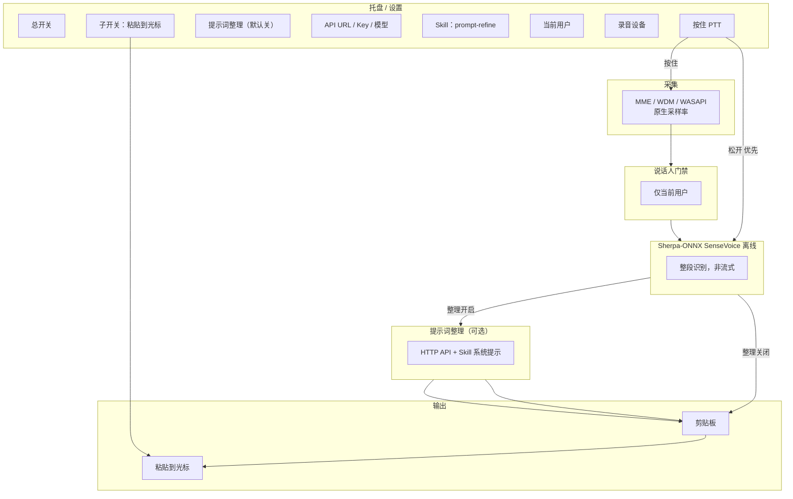

# Array Mic Refreshment

本地 Windows 后台常驻工具：**C# + Sherpa-ONNX**。按住 **PTT 快捷键** 采集音频 → **当前用户** 说话人门禁 → **离线句末 ASR（SenseVoice）** → 可选 **LLM 提示词整理（Skill）** → 剪贴板 / 光标粘贴。

阵列麦已在硬件侧完成降噪/增益；软件侧 `IAudioPreprocessor` 仅预留，首版不实现。

---

## 已定稿技术决策（综合版）

| # | 决策 | 说明 |
|---|------|------|
| 1 | **C# / .NET 8 + Sherpa-ONNX** | 宿主与推理栈确定；通过 Sherpa-ONNX C API / 官方 C# 示例封装 P/Invoke |
| 2 | **SenseVoice，离线、非流式，优先精准** | 使用 sherpa-onnx 的 **SenseVoice 离线模型**（整段一次识别）；不做流式 Partial 结果 |
| 3 | **首版即含 LLM 提示词整理，默认关闭** | 设置项「启用提示词整理」默认 **关**；打开后才调用户配置的 API |
| 4 | **Agent 开启时，剪贴板只放优化句** | 不写 ASR 原文；优化失败时可配置降级策略（见输出逻辑） |
| 5 | **松开 PTT 优先触发 ASR** | **松开快捷键** 立即截断并识别，优先级 **高于** VAD 句末；按住期间 VAD 句末仅作辅助（长句中间停顿） |
| 6 | **子开关 OFF：仍写剪贴板** | 子开关只控制 **是否自动粘贴到光标**；OFF = 不粘贴，**仍更新剪贴板** |
| 7 | **API 任意厂商 + 设置窗 + Skill** | 提供 API Base URL、Key、模型名等配置界面；内置 **`prompt-refine` Skill**（强提示词优化），可扩展用户自定义 Skill 路径 |
| 8 | **ASR 模型** | 首版默认 **SenseVoice int8**；保留 `IUtteranceAsr` 以便日后对比 **Paraformer / Qwen3-ASR**（见下文专节） |

---

## 产品目标

| # | 能力 | 首版 |
|---|------|------|
| 1 | 托盘常驻、用户/设备下拉 | ✅ |
| 2 | PTT + 离线句末 ASR（SenseVoice） | ✅ |
| 3 | 说话人门禁（当前用户） | ✅ |
| 4 | LLM 提示词整理（可选，默认关） | ✅ |
| 5 | 剪贴板 + 子开关控制粘贴 | ✅ |
| 6 | 设备可选，MME / WDM / WASAPI | ✅ |
| 7 | 采样率跟随设备，模型边界再 resample | ✅ |
| 8 | 音频预处理 | 🔌 预留 |

---

## 总体架构



### 触发与识别（PTT 优先级）

```text
按住 PTT  → 开始写入缓冲（设备原生采样率）
松开 PTT  → 【立即】结束本段、跑门禁 → SenseVoice 离线识别  （优先级最高）
按住期间  → VAD 可选判句末，仅用于「未松开时的中间切段」；不与松开抢触发权
```

### 输出逻辑（剪贴板 / 粘贴 / Agent）

| 提示词整理 | 子开关（粘贴） | 剪贴板内容 | 光标粘贴 |
|------------|----------------|------------|----------|
| OFF | OFF | ASR 原文 | 否 |
| OFF | ON | ASR 原文 | 是（有焦点时） |
| ON | OFF | **仅优化句** | 否 |
| ON | ON | **仅优化句** | 是 |

- **Agent 开启时绝不把 ASR 原文写入剪贴板**（调试日志可保留原文，默认不展示给用户）。
- 整理 API 失败：可配置 `OnRefineFailure: UseRawTranscript | ShowError | KeepLast`（首版建议 `UseRawTranscript` 并托盘提示）。

---

## 技术栈（确定）

| 层级 | 选型 |
|------|------|
| 语言 / UI | **C# / .NET 8**，托盘 + 设置窗 |
| ASR | **Sherpa-ONNX** → **SenseVoice 离线**（`OfflineRecognizer`） |
| 说话人 | ECAPA-TDNN ONNX（或 sherpa speaker） |
| VAD | Silero VAD（辅助，非主触发） |
| 音频 | NAudio + MME / WDM / WASAPI；边界 resample → 16 kHz mono（SenseVoice 要求） |
| 提示词整理 | 任意 **OpenAI-compatible** HTTP API；**内置 Skill** 驱动 system prompt |

### SenseVoice 模型（Sherpa-ONNX 预训练）

首版建议下载（manifest 指向官方 release）：

| 模型 ID | 说明 | 体积量级 |
|---------|------|----------|
| `sherpa-onnx-sense-voice-zh-en-ja-ko-yue-int8-2025-09-09` | 较新 int8，中英日韩粤 | ~230 MB |
| `sherpa-onnx-sense-voice-zh-en-ja-ko-yue-int8-2024-07-17` | 上一版 int8，作回退 | ~230 MB |

- **推理方式**：`OfflineRecognizer`，一次送入松开 PTT 后的整段 PCM。
- **非流式**：符合产品要求；延迟 = 段长 + 推理时间（段长短时通常可接受）。
- **输出注意**：SenseVoice 可能带情感/事件等标签字段，管道中需 **只取文本行** 或按 Sherpa API 关闭富文本标签（实现时对照 C# 示例）。

---

## LLM 提示词整理（首版即有，默认关）

### 设置界面（API 配置窗）

用户可填（不限厂商）：

- **API Base URL**（如 `https://api.openai.com/v1`、`https://api.deepseek.com/v1`、本机 `http://127.0.0.1:11434/v1`）
- **API Key**（本机 Ollama 可空）
- **Model**（如 `gpt-4o-mini`、`deepseek-chat`、`qwen-plus`）
- **启用提示词整理**（checkbox，**默认不勾选**）
- **Skill 路径**（可选，默认内置 `skills/prompt-refine/SKILL.md`）

### Skill：`prompt-refine`

首版在仓库提供 **`skills/prompt-refine/SKILL.md`**（或同等 JSON 配置），职责包括但不限于：

- 去口语 filler（嗯、那个、就是）
- 纠错同音字、补标点
- 将口语转为 **适合发给 AI 聊天机器人的一条提示词**（一句或短段，不扩写废话）
- 保留用户原意，禁止臆造事实
- 输出 **仅最终句子**，无 markdown 解释、无前缀「好的」

调用方式：`system` = Skill 内容 + 少量固定护栏；`user` = ASR 原文。

### 隐私（与出网）

- **音频、声纹**：不出网。
- **启用整理且 URL 为公网**：**文字出网**；首次开启须确认。
- **URL 为 127.0.0.1**：文字不出公网，仅本机服务。

---

## ASR 模型怎么选？（你仍不确定的部分）

你已倾向 **SenseVoice + 离线 + 要准**。下面是在 **Sherpa-ONNX 生态内** 的对比，便于日后换模型不换架构。

### 对比总表（中文场景、本地、句末）

| 模型 | 流式 | 中文/方言 | 精准度（经验位次） | 速度 / 资源 | 适合本工具 |
|------|------|-----------|-------------------|-------------|------------|
| **SenseVoice** | ❌ 离线为主 | 普粤英日韩等 | **高**（阿里 FunASR 系，多方评测中文强） | int8 ~230MB，CPU 可跑 | ✅ **已选** |
| **Paraformer（离线/流式）** | 可选 | 中文好 | 中高 | 更轻、更快 | 备选：极速 |
| **Zipformer / Transducer** | ✅ 流式 | 中文 | 中高 | 流式延迟低 | ❌ 你不做流式 |
| **Qwen3-ASR 0.6B/1.7B** | 支持 | 52 语 + 22 方言 | **很高** | 更重、更慢 | 备选：极致准 |
| **Whisper / faster-whisper** | 段式 | 多语 | 中等～中高 | 大模型偏慢 | 不推荐首版 |
| **Nemotron / Parakeet** | 流式 | **英文为主** | 英文极高 | 要 GPU 更佳 | ❌ 中文主线 |

### 为什么首版 SenseVoice 是合理默认？

1. **你要的是准，不是流式**：SenseVoice 在 sherpa 里走 **OfflineRecognizer**，和「松开 PTT → 整段识别」完全一致。
2. **和 Sherpa-ONNX 同源**：C# 绑同一套 `sherpa-onnx.dll`，换 Paraformer 只换模型路径，不动宿主。
3. **中文 + 粤语**：阵列麦/大陆用户常见；SenseVoice 预训练含 **粤语 (yue)**，比纯普通话模型更宽。
4. **体积可控**：int8 约 230MB，比 Qwen3-ASR 1.7B 小很多，比 Whisper large 更贴本地后台工具。

### 什么时候考虑换成 Qwen3-ASR？

- 实测 SenseVoice 在你的 **口音 / 噪声 / 专业词汇** 上 CER 仍不满意；
- 机器内存 ≥ 16GB、可接受识别慢 0.5～2×；
- 需要 **更多中文方言** 覆盖。

实施上：Phase 3 实现 `IUtteranceAsr`，默认 `SenseVoiceAsr`，设置里预留「引擎 + 模型路径」供高级用户切换。

### 什么时候仍用 Paraformer？

- 同一台机器上要 **极低 CPU**、句子极短、对错一个字无所谓；
- 作为 **A/B 对照** 而非默认。

### 建议的决策路径（减少纠结）

```text
首版上线     → SenseVoice int8（2025-09 优先，2024-07 作 fallback）
内部实测 2 周 → 记 CER/主观错误类型（专有名词、粤语、噪声）
不达标       → 同管道换 Qwen3-ASR-0.6B int4 ONNX 对比
仍不达标     → 考虑热词表 / 自定义词图（Sherpa 支持有限）或接受 LLM 整理兜底专有名词
```

**LLM 整理不能替代 ASR 准确率**：整理只能改表述，听错的字（如「张薇」→「张威」）仍需靠更好 ASR 或用户重说。因此 ASR 选 SenseVoice 是准度与工程量的平衡点。

---

## 音频与设备

- **协议**：WASAPI（默认）、WDM、MME 均需枚举与打开。
- **设备**：设置页下拉；默认 **系统默认录音设备**。
- **采样率**：跟随设备（48k/16k 等）；仅在送入 SenseVoice / 声纹模型前 **resample 16 kHz mono**。

---

## 模型分发

- Phase 3 起：`download-models.ps1` + `ModelManifest`（URL、SHA256）。
- 安装包「内置 / 在线下载」后期再做，不阻塞首版。

---

## 仓库目录规划

```text
ArrayMicRefreshment/
├── src/
│   ├── ArrayMicRefreshment.App/       # 托盘、设置窗、PTT
│   ├── ArrayMicRefreshment.Core/
│   ├── ArrayMicRefreshment.Audio/
│   ├── ArrayMicRefreshment.Speaker/
│   ├── ArrayMicRefreshment.Asr/       # Sherpa SenseVoice 封装
│   ├── ArrayMicRefreshment.Prompt/    # API + Skill 加载
│   └── ArrayMicRefreshment.Output/
├── skills/
│   └── prompt-refine/
│       └── SKILL.md                   # 强提示词优化 Skill
├── models/                            # gitignore
├── scripts/
│   └── download-models.ps1
└── README.md
```

---

## 分阶段实施计划

### Phase 0 — 底座

- [ ] .NET 8 解决方案、Sherpa native dll 部署说明
- [ ] 托盘：总开关、子开关、PTT 热键
- [ ] 设置窗：API URL / Key / Model、**整理默认关**、Skill 路径

### Phase 1 — 音频

- [ ] MME / WDM / WASAPI、设备下拉、原生采样率
- [ ] PTT 松开 **优先** 截断；VAD 辅助

### Phase 2 — 说话人

- [ ] 多用户 enrollment + 当前用户下拉

### Phase 3 — SenseVoice ASR

- [ ] `OfflineRecognizer` + SenseVoice int8 2025-09（fallback 2024-07）
- [ ] `IUtteranceAsr` 抽象 + 文本抽取（去掉情感标签等）

### Phase 4 — Prompt Skill + 输出

- [ ] `skills/prompt-refine/SKILL.md` + `HttpPromptRefiner`
- [ ] 剪贴板规则（Agent 开 = 仅优化句；子开关 = 仅控粘贴）
- [ ] 隐私确认弹窗

### Phase 5 — 发布

- [ ] 模型下载 / 可选完整包
- [ ] 实机 CER 记录表，决定是否试 Qwen3-ASR

---

## 关键接口

```csharp
interface IPushToTalkSource {
    event EventHandler PttPressed;
    event EventHandler PttReleased;  // 松开 → 立即触发识别管道
}

interface IUtteranceAsr {
    Task<string> RecognizeUtteranceAsync(AudioUtterance utterance, CancellationToken ct);
}

interface IPromptRefiner {
    bool IsEnabled { get; }
    Task<string> RefineAsync(string rawTranscript, CancellationToken ct);
}

interface ITranscriptSink {
    Task EmitAsync(string textToClipboard, bool pasteToCaret);
}

// 管道
ptt.PttReleased += async () => {
    if (!settings.MasterEnabled) return;
    var utterance = await audio.FinalizeOnReleaseAsync();
    if (!await speakerGate.VerifyCurrentUserAsync(utterance)) return;

    var raw = await asr.RecognizeUtteranceAsync(utterance);

    string output = raw;
    if (settings.PromptRefineEnabled) {
        output = await promptRefiner.RefineAsync(raw);
        // 剪贴板仅用 output（优化句）
    }

    await sink.EmitAsync(output, pasteToCaret: settings.PasteToCaretEnabled);
};
```

---

## 先进 ASR 参考（英文 / 研究向）

| 模型 | 场景 |
|------|------|
| NVIDIA Nemotron-ASR-Streaming | 英文流式工业级 |
| Cohere-transcribe | 英文榜单 |
| Qwen3-ASR | 中文极致准 + 方言 |

与本项目默认路径 **无冲突**：它们列在此处仅供日后 `IUtteranceAsr` 扩展，**首版不实现**。

---

## 本地开发（占位）

```powershell
git clone <repo>
cd array-mic-refreshment
./scripts/download-models.ps1
dotnet build
dotnet run --project src/ArrayMicRefreshment.App
```

---

## 文档索引

| 路径 | 内容 |
|------|------|
| `README.md` | 架构、已定稿决策、ASR 选型、输出逻辑 |
| `skills/prompt-refine/SKILL.md` | 提示词整理 Skill（Phase 4 落地） |
| `docs/PRIVACY_COPY.md` | 隐私文案定稿（可选） |

---

*已定稿：C# + Sherpa-ONNX + SenseVoice 离线；LLM 整理首版可选默认关；PTT 松开优先；Agent 开时剪贴板仅优化句。*
