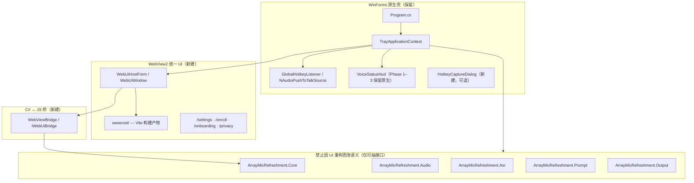

# 路线 B — 统一 WebView2 UI 升级实施说明

> **文档目的**：在对话上下文耗尽或人员交接后，任何 Agent / 工程师阅读本文即可按 **路线 B** 继续执行，无需依赖历史聊天记录。  
> **产品版本基准**：V0.3（`main` 分支，2026-05-26 前后）  
> **最后更新**：2026-05-28

---

## 0.1 与仓库对齐的现状快照（2026-05-28）

> **用途**：把「路线 B 规划」与 **当前代码事实** 绑在一起。  
> **分支参考**：`cursor/feature-presets-phase45-f621`（V0.4 + 功能预设 + Phase 4–5 收尾）。

| 维度 | 规划（§1.1） | **当前代码** |
|------|----------------|------------------|
| 产品对外版本 | V0.4 | ✅ `VERSION.txt` / `AppInfo` / csproj `0.4.x` 对齐 |
| WebView2 | 目标引入 | ✅ `Microsoft.Web.WebView2` + `Web/` 宿主与 Bridge |
| `ui/` + `wwwroot/` | Vite 前端 | ✅ Release 前 `npm ci && npm run build` |
| `SettingsApplyService` | Phase 0 | ✅ Web / 托盘共用 |
| 设置入口 | Web 为主 | ✅ 托盘「设置」→ `WebUiHostForm` `#/settings`（**无** WinForms 降级） |
| 注册入口 | Web `#/enroll` | ✅ Web 注册；`EnrollmentDialog` 已删除 |
| 功能预设 | — | ✅ 设置页「功能预设」+ 托盘「功能模式」；`FeaturePresetApplier` |
| CI Linux | build 可过 | ✅ `build-and-test`（Core/Audio/Prompt） |
| CI Windows | App.Tests | ✅ `build-windows` App.Tests（40 项）；`--blame-hang-timeout 2m` |
| 自动化验收 | Phase 2 | ✅ `scripts/test-phase2-route-b.ps1`、`scripts/test-feature-presets.ps1` |
| Web HUD | Phase 4 可选 | ✅ `VoiceWebStatusHud`（默认开启，可关；`AMR_WEB_HUD=0` 强制原生） |
| §10.2 手测 | 发布前 | ❌ **须 Windows 实机**（PTT/唤醒/麦克风/粘贴/Web HUD 焦点，脚本不覆盖） |

**结论**：路线 B **工程与自动化验收已完成**；发布前仍须 **§10.2 手动回归**。

**与本仓库其他文档**：

| 文档 | 与路线 B 关系 |
|------|----------------|
| [`README.md`](../README.md) | WebView2 设置 + 功能预设（V0.4） |
| [`docs/HANDOFF_PHASE5.md`](HANDOFF_PHASE5.md) | 音频/Sherpa/打包；**不替代** UI 升级 |
| [`docs/LOCAL_DEVELOPMENT.md`](LOCAL_DEVELOPMENT.md) | 含 `ui/` 构建与 Windows 测试脚本 |
| [`AGENTS.md`](../AGENTS.md) | 任务收尾自检 + push 后 CI（无跳过） |

---

## 0. 读者须知（30 秒版）

| 问题 | 答案 |
|------|------|
| 路线 B 是什么？ | **一个 Web 前端（HTML/CSS/JS）+ WinForms 原生壳**；所有「窗口级 UI」统一进 WebView2，视觉与交互像 PWA。 |
| 什么保持原生？ | 托盘、`RegisterHotKey` 全局热键、音频采集、Sherpa 唤醒/ASR、粘贴 HWND、（首版）`VoiceStatusHud`。 |
| 会不会降低识别/唤醒率？ | **不会**（若遵守本文「禁止改动边界」）；Web 不参与麦克风→推理链路。 |
| 主要风险？ | UI 线程卡顿、WebView2 焦点、内存占用、JS↔C# 桥接 bug、Runtime 缺失。 |

---

## 1. 背景与决策记录

### 1.1 当前 UI 现状（V0.3）

| 组件 | 文件 | 技术 | 行数级 |
|------|------|------|--------|
| 应用入口 | `src/ArrayMicRefreshment.App/Program.cs` | WinForms `Application.Run(TrayApplicationContext)` | ~40 |
| 托盘 + 编排 | `src/ArrayMicRefreshment.App/TrayApplicationContext.cs` | `NotifyIcon` + `ContextMenuStrip` + 音频/管道生命周期 | ~1100 |
| 设置窗 | `src/ArrayMicRefreshment.App/SettingsForm.cs` | `TableLayoutPanel` 手工布局 | ~1270 |
| 状态 HUD | `src/ArrayMicRefreshment.App/VoiceStatusHud.cs` | 无边框 `Form` + `WS_EX_NOACTIVATE` | ~150 |
| 说话人注册 | `src/ArrayMicRefreshment.App/EnrollmentDialog.cs` | WinForms | ~170 |
| PTT 热键录入 | `src/ArrayMicRefreshment.App/Controls/HotkeyCaptureTextBox.cs` | 自定义 `TextBox` | ~180 |

**框架约束**：`ArrayMicRefreshment.App.csproj` 使用 `<UseWindowsForms>true</UseWindowsForms>`，**无 WPF / 无 WebView2（尚未引入）**。

### 1.2 为何选路线 B（而非 WinForms 换肤或 WPF 重写）

用户目标：**轻量 Web / PWA 式布局与渲染**，同一产品、同一设计系统。

| 方案 | 结论 |
|------|------|
| A. 纯 WinForms 主题库 | 视觉上限低，SettingsForm 难维护，**不选** |
| **B. WebView2 统一 Web UI + 原生壳** | **选中**；设置/注册/引导可 Web 化；托盘与热键保留原生 |
| C. WPF / Avalonia 全量重写 | 周期长、与 Win-only 深度集成不匹配，**不选** |
| D. Electron | 重复运行时、与 Sherpa/NAudio 同进程复杂，**不选** |

### 1.3 「统一 UI」的定义（避免误解）

**对用户**：一个产品、一套颜色/字体/间距/组件风格。  
**对工程**：不是 100% HTML，而是：

```
可见的主界面（设置、注册、引导）→ 同一个 Web 应用（多路由）
系统能力（托盘、全局热键、HWND 粘贴）→ 原生 C#
实时状态 HUD（首版）→ 原生 Form，但视觉 token 与 Web 一致
音频/唤醒/ASR/整理 → 现有 C# 领域层，UI 技术无关
```

---

## 2. 目标架构

### 2.1 分层图



### 2.2 音频/识别路径（与 UI 无关，必须保持）

```text
PTT 热键 / 唤醒词
  → VoiceCaptureOrchestrator
  → PttCaptureService / WakeWordCaptureService  （Audio）
  → SpeakerGate（可选）
  → Sherpa SenseVoice ASR                        （Asr）
  → VoicePipeline                                （Core）
  → 可选 PromptRefiner / IntentRouter            （Prompt）
  → ClipboardTranscriptSink                      （Output）
```

**任何 Agent 不得**在 WebView 或 JS 中实现上述链路。

### 2.3 设置保存路径（必须与现有一致）

当前：`TrayApplicationContext.OnOpenSettings` → `SettingsForm.ShowDialog` → OK 时：

1. `SettingsCopier.CopyInto(form.Settings, _settings)`
2. `SettingsCopier.RequiresPipelineRebuild` → 可能 `BuildPipeline`
3. 否则 `_pipeline.ApplySettings`
4. PTT 热键变更 → `NAudioPushToTalkSource.TryUpdateHotkey`
5. `TriggerMode` 变更 → `SetVoiceTriggerMode`
6. 唤醒词/灵敏度/静音 → `_wakeDetector` / `WakeWordCaptureService.ApplySettings`
7. `LaunchAtStartup` → `WindowsStartupRegistration.Apply`
8. `PersistAndRefresh` / `RefreshAudioCaptureAfterSettings`

Web 设置页 **必须复用上述逻辑**，仅替换「表单 UI」为 bridge 调用。

---

## 3. 禁止改动边界（Red Zone）

以下目录/类 **禁止** 为 UI 方便而改行为语义（可抽接口、可注入，不可改算法默认值）：

| 区域 | 路径 | 说明 |
|------|------|------|
| PTT 采集 | `src/ArrayMicRefreshment.Audio/PttCaptureService.cs` | 含 standby pre-roll；UI 线程纪律已修复 |
| 唤醒采集 | `src/ArrayMicRefreshment.Audio/WakeWordCaptureService.cs` | KWS + dictation 结束逻辑 |
| 热键 | `src/ArrayMicRefreshment.Audio/Windows/GlobalHotkeyListener.cs` | WndProc 在 UI 线程 |
| ASR | `src/ArrayMicRefreshment.Asr/**` | Sherpa 封装 |
| 管道 | `src/ArrayMicRefreshment.Core/VoicePipeline.cs` | 整理门控 |
| 粘贴 | `src/ArrayMicRefreshment.Output/ClipboardTranscriptSink.cs` | HWND 目标 |

**Yellow Zone**（可重构、需回归测试）：

| 区域 | 说明 |
|------|------|
| `TrayApplicationContext.cs` | 抽 `AppOrchestrator` / `SettingsApplyService` |
| `SettingsForm.cs` | Phase 3 后删除 |
| `EnrollmentDialog.cs` | Phase 4 后删除 |

**Green Zone**（自由新建）：

| 区域 | 说明 |
|------|------|
| `src/ArrayMicRefreshment.App/Web/**` | WebView2 宿主、Bridge |
| `ui/` 或 `src/ArrayMicRefreshment.App/wwwroot/` | 前端源码 |
| `docs/UI_*` | 文档 |

---

## 4. 功能风险与对策（路线 B 专项）

| 风险 | 影响 | 对策 |
|------|------|------|
| UI 线程阻塞 | PTT HUD 延迟、热键响应慢 | Bridge 慢操作 `Task.Run`；禁止在 WndProc 路径同步 await LLM |
| WebView2 抢焦点 | 粘贴失败 | 设置窗不用 TopMost；HUD 首版保持原生 `WS_EX_NOACTIVATE` |
| 内存 +100~200MB | 低配机整体卡 | 设置窗关闭时 Dispose WebView；不在启动时预创建 |
| Bridge 保存 bug | 麦克风/Wake 状态错乱 | 复用 `SettingsCopier` + 现有 apply 方法；集成测试 |
| Runtime 缺失 | 设置打不开 | 启动检测；release 文档说明；可选 Fixed Runtime |
| **ASR/唤醒率下降** | 用户感知「变差」 | **不碰 Audio/Asr**；用日志对比 `PTT capture ready …ms` |

### 4.1 性能回归指标（集成后必测）

在 `%AppData%\ArrayMicRefreshment\logs\app-*.log` 检查：

| 指标 | 期望 |
|------|------|
| `PTT capture ready …ms after press` | PttOnly + standby：`standby=true`，通常 **< 30ms** |
| `Wake dictation ended after …ms continuous silence` | 接近用户配置的 `WakeCommandSilenceMs` |
| 设置保存后 | 无异常 `Failed to apply wake phrase` / `PTT hotkey` 错误 |

---

## 5. 设计系统（Design Tokens）

所有 Web 页面与原生 HUD **共用同一套数值**（先写 CSS，C# 从 JSON 或常量同步）。

**文件**：`ui/src/styles/tokens.css`（构建后复制到 `wwwroot/css/tokens.css`）

```css
:root {
  --color-bg: #f8fafc;
  --color-surface: #ffffff;
  --color-text: #0f172a;
  --color-text-muted: #64748b;
  --color-border: #e2e8f0;
  --color-accent: #2563eb;
  --color-accent-hover: #1d4ed8;
  --color-danger: #dc2626;
  --color-success: #16a34a;

  --radius-sm: 8px;
  --radius-md: 12px;
  --radius-lg: 16px;

  --shadow-sm: 0 1px 2px rgb(15 23 42 / 6%);
  --shadow-md: 0 8px 24px rgb(15 23 42 / 8%);

  --font-sans: "Segoe UI", system-ui, -apple-system, sans-serif;
  --font-size-sm: 13px;
  --font-size-base: 14px;
  --font-size-lg: 16px;

  --space-1: 4px;
  --space-2: 8px;
  --space-3: 12px;
  --space-4: 16px;
  --space-6: 24px;
  --space-8: 32px;

  /* HUD 深色条（与现 VoiceStatusHud 对齐） */
  --hud-bg: rgb(28 28 30 / 94%);
  --hud-text: #f5f5f5;
  --hud-error: #fca5a5;
}

@media (prefers-color-scheme: dark) {
  :root {
    --color-bg: #0b1220;
    --color-surface: #111827;
    --color-text: #f1f5f9;
    --color-text-muted: #94a3b8;
    --color-border: #1e293b;
  }
}
```

**Macaron 配色（已实现）**：`ui/src/styles/tokens.css` 使用马卡龙 Pastel 色系，而非下方示例中的 slate 蓝灰。主 accent 为 sky `#7EC8E3`，辅以 pink `#FFB8D0`、lavender `#C9B6F0`、mint `#B8E8D0` 等；背景 `#FFF8FB` → `#F3FAFF` 渐变。Web 设置页、注册页与卡片组件均只引用 token 变量，便于日后 HUD 原生控件对齐（Phase 4）。

**组件约定**（Web）：

- 布局：左侧 **Nav 240px** + 右侧 **Content**（PWA 设置页）
- 分组：`card` 白底圆角 + `card-title`
- 主按钮：`btn-primary`；次按钮：`btn-ghost`
- 表单：`label` 上置，`input/select` 全宽，错误态红色描边
- 底部：**Sticky footer**「保存 / 取消」

---

## 6. 目录结构（目标态）

```text
array-mic-refreshment/
├── ui/                                    # 前端 monorepo（Vite）
│   ├── package.json
│   ├── vite.config.ts
│   ├── index.html
│   └── src/
│       ├── main.ts                        # 路由入口
│       ├── router.ts                      # /settings /enroll /onboarding /privacy
│       ├── bridge.ts                      # 封装 hostObjects.amr
│       ├── styles/
│       │   ├── tokens.css
│       │   └── components.css
│       └── pages/
│           ├── SettingsPage.ts
│           ├── EnrollPage.ts
│           ├── OnboardingPage.ts
│           └── PrivacyPage.ts
│
├── src/ArrayMicRefreshment.App/
│   ├── Web/
│   │   ├── WebUiHostForm.cs               # WebView2 容器 Form
│   │   ├── WebUiBridge.cs                 # [ComVisible] bridge 实现
│   │   ├── IWebUiBridge.cs                # 接口（便于测试）
│   │   ├── WebView2RuntimeChecker.cs
│   │   └── HotkeyCaptureDialog.cs         # 原生热键捕获小窗
│   ├── Services/
│   │   └── SettingsApplyService.cs        # 从 TrayApplicationContext 抽出保存逻辑
│   ├── wwwroot/                           # Vite build 输出（gitignore 或提交 dist）
│   │   ├── index.html
│   │   └── assets/
│   └── ...（现有文件逐步废弃 SettingsForm）
│
└── docs/
    └── UI_ROUTE_B_WEBVIEW2.md             # 本文
```

---

## 7. JS ↔ C# Bridge 契约（必须实现）

### 7.1 注册方式（C#）

```csharp
// WebUiHostForm 内，NavigationCompleted 后：
webView.CoreWebView2.AddHostObjectToScript("amr", new WebUiBridge(_services));
// 开发时可选：webView.CoreWebView2.OpenDevToolsWindow();
```

JS 访问：`window.chrome.webview.hostObjects.amr`（注意 async 代理，需 `await` 或 `.sync` 包装）。

### 7.2 建议接口清单

以下 JSON 形状与 `AppSettings` + UI 需求对齐；实现时用 `System.Text.Json` 序列化 DTO，**勿**把 `AppSettings` 直接暴露给 COM。

#### 只读 / 元数据

| 方法 | 返回 | 说明 |
|------|------|------|
| `GetAppInfo()` | `{ version, platform }` | `AppInfo.Version` |
| `GetRuntimeState()` | `{ triggerMode, masterEnabled, ... }` | 托盘运行时模式（`RuntimeTriggerMode`） |
| `ListAudioDevices()` | `[{ id, displayName, isDefault }]` | 复用 `DeviceComboPopulator` |
| `ListSpeakerUsers()` | `[{ id, displayName, isNone }]` | 复用 enrollment |
| `ListAsrModels()` | `[{ id, displayName, installed }]` | 复用 `SenseVoiceModelResolver` |
| `ListOptionalOverlaySkills()` | `[{ key, label, checked }]` | manifest optional_skills |
| `GetSkillsCatalogStatus()` | `{ missingFiles: string[] }` | 保存前校验 |

#### 设置读写

| 方法 | 参数 | 说明 |
|------|------|------|
| `LoadSettingsDraft()` | — | 返回完整 draft DTO（见 7.3） |
| `ValidateSettingsDraft(draftJson)` | JSON | 返回 `{ ok, errors: [{ field, message }] }` |
| `SaveSettingsDraft(draftJson)` | JSON | 执行与 `OnOpenSettings` OK 相同逻辑；返回 `{ ok, error? }` |
| `TestLlmConnection(draftJson?)` | 可选 draft | 复用 SettingsForm 测试连接逻辑 |

#### 热键（原生对话框）

| 方法 | 说明 |
|------|------|
| `OpenHotkeyCaptureDialog(currentHotkey)` | 打开 `HotkeyCaptureDialog` modal；返回 `{ hotkey, cancelled }` |

Web **不能**直接监听全局热键；必须走此方法。

#### 说话人注册

| 方法 | 说明 |
|------|------|
| `StartEnrollmentUtterance()` | 开始录音段 |
| `StopEnrollmentUtterance()` | 返回 `{ durationMs, ok }` 或 audio 元数据 |
| `CompleteEnrollment(name, utteranceCount)` | 调用 `_enrollment.AddUser` |

（或 enrollment 仍用独立 Web 路由 + 同上 API。）

#### 隐私

| 方法 | 说明 |
|------|------|
| `GetPrivacyConsentState()` | 是否需弹窗、host |
| `AcceptPrivacy(host)` | 写 `PrivacyAcceptedHost` |

### 7.3 Settings Draft DTO 字段映射

与 `AppSettings` 一一对应（Web 表单全部覆盖 `SettingsForm`）：

```typescript
interface SettingsDraft {
  masterEnabled: boolean;
  pasteToCaretEnabled: boolean;
  launchAtStartup: boolean;
  promptRefineEnabled: boolean;
  forcedIntent: 'Auto' | 'PlainText' | 'GeneralAi' | 'CodeEditing' | 'Research' | 'TaskPlan';
  onRefineFailure: 'UseRawTranscript' | 'ShowError' | 'KeepLast';

  selectedDeviceId: string | null;
  currentSpeakerUserId: string | null;
  speakerVerifyThreshold: number;

  selectedAsrModelId: string;
  skillsDirectory: string;
  modelsDirectory: string;

  triggerMode: 'PttOnly' | 'WakeWordOnly' | 'Both';
  wakeWordPhrase: string;
  wakeWordSensitivity: 'Standard' | 'High' | 'Maximum';
  wakeCommandSilenceMs: number;
  wakeUseVadEndDetection: boolean;

  hudScreenCorner: 'BottomRight' | 'BottomLeft' | 'TopRight' | 'TopLeft';
  pttHotkey: string;

  selectedLlmPresetIndex: number;
  llmPresets: Array<{ name: string; apiBaseUrl: string; apiKey: string; apiModel: string }>;
  optionalOverlaySkills: string[];
}
```

**注意**：

- `triggerMode` 持久化到 settings.json，但托盘可 **运行时** 覆盖；Web 页打开时应显示 `RuntimeTriggerMode ?? TriggerMode`（与现 `SettingsForm.RuntimeTriggerMode` 相同）。
- API Key 从 `%AppData%\ArrayMicRefreshment\settings.json` 读取，**不得**写入仓库。

### 7.4 Bridge 线程模型

| 操作 | 线程 |
|------|------|
| `LoadSettingsDraft` | UI 或线程池均可 |
| `SaveSettingsDraft` | **必须在 UI 线程**调用 WinForms / 热键注册 / MessageBox |
| `TestLlmConnection` | **后台线程**执行 HTTP；完成后 UI 线程更新 |
| ASR 模型下载 | 后台 + 进度事件（可选 `PostWebMessage` 推送到 JS） |

---

## 8. 分阶段实施计划

### Phase 0 — 解耦（1 周，无可见 UI 变化）

**目标**：抽出可测试的应用服务，WinForms 仍可用。

| 任务 | 产出 |
|------|------|
| 新建 `SettingsApplyService` | 从 `TrayApplicationContext.OnOpenSettings` 抽出 save/apply 逻辑 |
| 新建 `ISettingsEditorSession` | 封装 load/save/test |
| 单元测试 | 对 `SettingsCopier.RequiresPipelineRebuild` 已有测试；加 ApplyService  mock 测试 |
| 文档 | 更新本文 Phase 0 checklist |

**验收**：`dotnet test` 全绿；手动测试 WinForms 设置保存行为不变。

---

### Phase 1 — 基础设施（1 周）

| 任务 | 产出 |
|------|------|
| 添加 NuGet `Microsoft.Web.WebView2` | `ArrayMicRefreshment.App.csproj` |
| `WebView2RuntimeChecker` | 缺失时 MessageBox + 文档链接 |
| `ui/` Vite 项目 + `tokens.css` + 空白 `/settings` | 本地 `npm run build` |
| csproj 复制 `wwwroot/**` 到输出 | `CopyToOutputDirectory` |
| `WebUiHostForm` 加载 `wwwroot/index.html#/settings` | 托盘菜单可打开（空白页即可） |

**验收**：Release build 后双击 exe → 设置 → 看到 WebView2 空白/Hello 页。

---

### Phase 2 — 设置页 Web 化（2~3 周，核心）

| 任务 | 产出 |
|------|------|
| 实现 `WebUiBridge` 全部 settings API | 见 §7 |
| `SettingsPage` 完整表单 | 侧栏 Nav + 各 section |
| 热键 | 「点击录入」→ `OpenHotkeyCaptureDialog` |
| LLM 测试连接 | 异步 + loading 态 |
| 替换托盘入口 | `OnOpenSettings` → `WebUiHostForm` |
| 保留 `SettingsForm` | `#if DEBUG` 降级或 feature flag |

**验收 checklist**（与 V0.3 WinForms 对照）：

- [ ] 设备选择、ASR 模型、声纹用户/阈值
- [ ] LLM 三预设切换/改名/URL/Key/Model
- [ ] 整理开关、整理风格、失败策略、optional overlay skills
- [ ] 触发模式、唤醒词全套、HUD 角、PTT 热键
- [ ] 开机自启
- [ ] Skills 目录、模型缺失提示
- [ ] 保存后 pipeline 重建、热键更新、wake 重启、standby 逻辑
- [ ] API Key 不出现在 git

---

### Phase 3 — 注册 / 隐私 / 引导（1 周）

| 页面 | 替换 |
|------|------|
| `/enroll` | `EnrollmentDialog` |
| `/privacy` | `PrivacyConsent` |
| `/onboarding`（可选） | 首次启动检测模型/麦克风 |

---

### Phase 4 — HUD 视觉统一（可选，3~5 天）

**默认**：保留原生 `VoiceStatusHud`，仅从 `tokens.json` 读取颜色/圆角。  
**可选实验**：透明 WebView2 HUD；**必须通过**「唤醒/PTT 不抢焦点、粘贴成功」回归，否则回退原生。

---

### Phase 5 — 收尾与发布（1 周）

| 任务 | 说明 |
|------|------|
| 删除 `SettingsForm.cs`、`EnrollmentDialog.cs` | 确认无引用 |
| 更新 `scripts/build-release.ps1` | 增加 `npm ci && npm run build` |
| 更新 README / CHANGELOG | 版本 V0.4 |
| WebView2 Runtime 策略 | Evergreen vs Fixed 文档化 |
| 同步 csproj 版本号 | 当前 `InformationalVersion` 与 `AppInfo` 可能不一致，一并修正 |

---

## 9. 构建与发布变更

### 9.1 本地开发

```powershell
# 前端
cd ui
npm ci
npm run dev          # 可选：WebView2 开发时 Navigate http://localhost:5173

# 后端
cd ..
dotnet build src/ArrayMicRefreshment.App/ArrayMicRefreshment.App.csproj
```

### 9.2 Release（目标脚本片段）

在 `scripts/build-release.ps1` 的 `dotnet publish` **之前**插入：

```powershell
Push-Location (Join-Path $repoRoot 'ui')
npm ci
npm run build
Pop-Location

$wwwDst = Join-Path $outDir 'wwwroot'
$wwwSrc = Join-Path $repoRoot 'src/ArrayMicRefreshment.App/wwwroot'
# robocopy $wwwSrc $wwwDst ...
```

### 9.3 WebView2 Runtime

| 模式 | 适用 |
|------|------|
| Evergreen | 体积较小；依赖系统 Edge WebView2 |
| Fixed Version | 离线 zip 包；体积 +~150MB |

检测 API：`Microsoft.Web.WebView2.Core.CoreWebView2Environment.GetAvailableBrowserVersionString()`

---

## 10. 测试策略

### 10.1 自动化

| 层 | 内容 |
|----|------|
| 已有 | `tests/ArrayMicRefreshment.*` — **每次 PR 必须全绿** |
| 已有 | `WebUiBridge` 单元测试（mock `ISettingsStore`） |
| **Phase 2 验收（本地 Windows）** | `tests/ArrayMicRefreshment.App.Tests/Phase2AcceptanceTests.cs`，Trait `Phase=RouteB2` |
| **一键脚本** | `.\scripts\test-phase2-route-b.ps1`（`npm build` + Phase2 测试 + 全量 App.Tests） |
| 可选 | Playwright + WebView2 驱动 UI 测试（Windows CI） |

```powershell
# 仅 Phase 2 自动化项（约 10 条，对应 §8 checklist 的 Bridge/保存/校验）
.\scripts\test-phase2-route-b.ps1

# 或
dotnet test tests/ArrayMicRefreshment.App.Tests/ArrayMicRefreshment.App.Tests.csproj -c Release --filter "Phase=RouteB2"
```

**说明**：自动化覆盖 **Web 设置 Bridge 与 `SettingsApplyService` 行为**，**不能**替代 §10.2 的 PTT/唤醒/麦克风实机回归。

### 10.2 手动回归（发布前）

1. **PttOnly**：standby 开麦 → 按下 PTT → HUD 即时 → 说话 → 松开 → ASR 正确  
2. **Both**：唤醒 → 指令 → PTT 按住补充 → 不丢字头  
3. **WakeWordOnly**：PTT 提示不可用  
4. Web 设置保存 → 各模式切换 → 热键修改  
5. 整理 ON + 各 `ForcedIntent`  smoke test  
6. 关闭设置窗 → 内存不持续增长（任务管理器观察）

---

## 11. 并行 Agent 分工（4~5 人/Agent 可同时开工）

> **集成负责人**（主 Agent）：合并分支、解决冲突、跑 `dotnet test`、执行 §10.2、更新本文 checklist。

| Agent ID | 分支建议 | 职责 | 依赖 |
|----------|----------|------|------|
| **A1 架构/解耦** | `feat/ui-b-phase0-orchestrator` | Phase 0：`SettingsApplyService`、接口定义 | 无 |
| **A2 Web 基础设施** | `feat/ui-b-phase1-webview2` | Phase 1：WebView2、Vite、tokens、HostForm | 可与 A1 并行 |
| **A3 前端设置页** | `feat/ui-b-phase2-settings-ui` | Phase 2：`SettingsPage` 全部 section + bridge.ts | 需 A2 的 bridge 契约；可用 mock |
| **A4 Bridge 后端** | `feat/ui-b-phase2-bridge` | Phase 2：`WebUiBridge` 实现 §7 全部 C# API | 需 A1 的 ApplyService |
| **A5 注册/隐私/构建** | `feat/ui-b-phase3-enroll-build` | Phase 3 页面 + build-release.ps1 + Runtime 检测 | A2 完成后 |

**合并顺序**：A1 → A2 → A4 + A3（可并行）→ A5 → 集成测试。

---

## 12. 子 Agent 完整 Prompt（复制即用）

### Agent A1 — 架构解耦

```text
你在 array-mic-refreshment 仓库执行 UI 路线 B Phase 0。

阅读 docs/UI_ROUTE_B_WEBVIEW2.md 全文，重点 §2.3、§3、§8 Phase 0。

任务：
1. 从 TrayApplicationContext.OnOpenSettings（SettingsForm OK 分支）抽出 SettingsApplyService（或等价命名）。
2. 输入：previous settings snapshot、new AppSettings；输出：ApplyResult（是否 rebuild pipeline、是否 hotkey changed 等）。
3. TrayApplicationContext 改为调用该服务，SettingsForm 行为不变。
4. 不引入 WebView2；不修改 Audio/Asr/Core 算法。
5. dotnet test 全绿。

禁止：改 PttCaptureService、WakeWordCaptureService、VoicePipeline 语义。
交付：PR 描述列出提取的方法与测试覆盖。
```

### Agent A2 — WebView2 基础设施

```text
你在 array-mic-refreshment 仓库执行 UI 路线 B Phase 1。

阅读 docs/UI_ROUTE_B_WEBVIEW2.md §5、§6、§8 Phase 1、§9。

任务：
1. ArrayMicRefreshment.App.csproj 添加 Microsoft.Web.WebView2。
2. 创建 ui/ Vite+TS 项目，含 tokens.css、router 骨架、pages/SettingsPage 占位。
3. 构建输出到 src/ArrayMicRefreshment.App/wwwroot/。
4. 实现 WebUiHostForm、WebView2RuntimeChecker。
5. 托盘「设置」可打开 WebUiHostForm 加载 wwwroot（内容可为 Hello）。
6. 不在 Application.Run 前初始化 WebView2。

禁止：修改 Audio/Asr；删除 SettingsForm。
交付：本地 build 可打开 WebView 设置窗。
```

### Agent A3 — 前端设置页

```text
你在 array-mic-refreshment 仓库执行 UI 路线 B Phase 2 前端。

阅读 docs/UI_ROUTE_B_WEBVIEW2.md §5、§7.3、§8 Phase 2。

任务：
1. 在 ui/src/pages/SettingsPage 实现完整设置 UI（侧栏+卡片布局，PWA 风格）。
2. 字段覆盖 SettingsDraft（§7.3）全部项；唤醒区块随 triggerMode 显示/隐藏。
3. bridge.ts 封装 hostObjects.amr；Load/Save/Validate/TestConnection。
4. PTT 热键按钮调用 OpenHotkeyCaptureDialog，不自己在 web 监听键盘。
5. 样式仅用 tokens.css + components.css，无重型 UI 库（可选 Preact）。

依赖：若 bridge 未就绪，用 mock Promise 开发。
禁止：把 API Key 写死或提交到 git。
交付：截图 + 与 SettingsForm 字段对照表。
```

### Agent A4 — Bridge 后端

```text
你在 array-mic-refreshment 仓库执行 UI 路线 B Phase 2 后端 Bridge。

阅读 docs/UI_ROUTE_B_WEBVIEW2.md §7、§2.3、§8 Phase 2。

任务：
1. 实现 WebUiBridge（ComVisible）对应 §7.2 全部方法。
2. SaveSettingsDraft 必须复用 SettingsApplyService（Phase 0）或 Tray 现有 apply 逻辑。
3. TestLlmConnection 复用 OpenAiCompatiblePromptRefiner 测试路径。
4. ListAudioDevices/ListAsrModels 等复用 SettingsForm 已有 private 方法（可抽到 Shared helper）。
5. OpenHotkeyCaptureDialog：包装 HotkeyCaptureTextBox 为小 Form。
6. 线程：Save 在 UI 线程；Test LLM 在后台。

禁止：修改 PttCaptureService/WakeWordCaptureService。
交付：单元测试 + WebUiHostForm 与真实 bridge 联调说明。
```

### Agent A5 — 注册/隐私/构建

```text
你在 array-mic-refreshment 仓库执行 UI 路线 B Phase 3 + 构建。

阅读 docs/UI_ROUTE_B_WEBVIEW2.md §8 Phase 3、§5、§9。

任务：
1. ui/src/pages/EnrollPage、PrivacyPage（+ 可选 OnboardingPage）。
2. Bridge 扩展 enrollment/privacy API（§7.2）。
3. 托盘「注册说话人」改开 WebUiHostForm #/enroll。
4. 更新 scripts/build-release.ps1：publish 前 npm run build + 复制 wwwroot。
5. WebView2 Runtime 缺失时的用户提示。

依赖：A2 的 WebUiHostForm、A4 部分 bridge 方法。
禁止：删除 SettingsForm 直到集成负责人确认 Phase 2 验收通过。
交付：build-release self-contained 包内 wwwroot 完整。
```

### 集成负责人 Prompt

```text
你是 array-mic-refreshment UI 路线 B 集成负责人。

阅读 docs/UI_ROUTE_B_WEBVIEW2.md 全文。

任务：
1. 按 §11 合并顺序集成 A1→A2→A4/A3→A5。
2. 跑 dotnet test；执行 §10.2 手动回归；检查日志 PTT/Wake 指标（§4.1）。
3. Phase 2 验收 checklist（§8）全部勾选后再删 SettingsForm。
4. 更新 CHANGELOG V0.4；同步 AppInfo 与 csproj 版本号。
5. 冲突时优先保证 Audio/Asr 行为不变。

输出：集成报告（已知问题、回退方案、是否保留 SettingsForm 降级开关）。
```

---

## 13. 与现有文档的关系

| 文档 | 关系 |
|------|------|
| `docs/HANDOFF_PHASE5.md` | 音频/Sherpa/打包；UI 升级 **不替代** 该文档 |
| `docs/WAKE_WORD_RUNTIME.md` | 唤醒行为规格；Bridge 不得改语义 |
| `docs/SKILL_PIPELINE.md` | 整理/Skill；设置页只暴露已有字段 |
| `README.md` | Phase 5 完成后更新「设置窗」描述为 WebView2 |

---

## 14. Phase 完成 Checklist（主 Agent 勾选）

> 状态截至分支 `cursor/ui-route-b-integration-f621` 集成（2026-05-26）。

### Phase 0
- [x] `SettingsApplyService` 已提取
- [x] `TrayApplicationContext` 使用 Service（WinForms OK + `SaveSettingsDraft`）
- [x] `dotnet test`（CI slnf 82 项）通过；App.Tests 待 Windows

### Phase 1
- [x] WebView2 NuGet + Runtime 检测
- [x] `ui/` + `wwwroot/` 构建通
- [x] 托盘可打开 Web 设置壳

### Phase 2
- [x] Bridge API 实现（见 §17 已知缺口）
- [x] SettingsPage 字段 parity（§7.3 + WinForms-only 项见 A3 对照表）
- [x] 保存逻辑 parity（§2.3，经 `SettingsApplyService`）
- [x] SettingsForm **已删除** — 仅 WebView2 设置入口

### Phase 3
- [x] Enroll + Privacy Web 化（Onboarding 骨架）
- [x] build-release 含前端构建

### Phase 4（可选）
- [x] HUD token 统一（`DesignTokens` + `VoiceStatusHud` 对齐 `tokens.css`）
- [x] Web HUD 实验（`VoiceWebStatusHud` + `#/hud`；`WS_EX_NOACTIVATE`；设置项「WebView2 状态 HUD」；失败回退原生）

### Phase 5
- [x] 旧 Form 删除（`SettingsForm`、`EnrollmentDialog`、`WebUiFeatureFlags`）
- [x] V0.4 发布说明 / 版本号对齐
- [ ] §10.2 手动回归通过

---

## 17. 集成报告（2026-05-26，五 Agent 合并）

### 17.1 执行摘要

| Agent | 职责 | 状态 |
|-------|------|------|
| A1 | Phase 0 `SettingsApplyService` | ✅ 已合并 |
| A2 | Phase 1 WebView2 + Vite + `WebUiHostForm` | ✅ 已合并 |
| A3 | Phase 2 前端 `SettingsPage` | ✅ 已合并 |
| A4 | Phase 2 `WebUiBridge` + 单测 | ✅ 已合并（见缺口） |
| A5 | Phase 3 注册/隐私 + `build-release.ps1` | ✅ 已合并 |

**合并顺序**：A1 → A2 → A4/A3 → A5（同分支串行提交，无跨分支冲突）。

**自动化验证**：

- `dotnet build ArrayMicRefreshment.sln -c Release` — 0 错误（16 警告，含 WebView2/WindowsBase 版本统一警告）
- `dotnet test ArrayMicRefreshment.CI.slnf` — 82 passed
- `cd ui && npm run build` — 成功

### 17.2 已知缺口（发布前须处理）

1. **Windows 实机 §10.2**：PTT / 唤醒 / 粘贴 / Web 设置保存 — **未测**。
2. **App.Tests**：需在安装 `Microsoft.WindowsDesktop.App` 的 Windows 上跑全量。
3. **Bridge**：ASR 模型下载按钮无 Web API；远程 API 隐私在**有窗体**时仍弹 `MessageBox`（无 owner 时 headless/CI 不阻塞）；`ListOptionalOverlaySkills` 用已持久化目录非 draft。
4. **CI**：`build-windows` 须绿；勿在单元测试构造 `NAudioPushToTalkSource`（会泄漏 WinForms `Timer` 导致 testhost 挂死）。

### 17.3 回退方案

| 场景 | 操作 |
|------|------|
| Web 设置不可用 | 安装 [WebView2 Runtime](https://developer.microsoft.com/microsoft-edge/webview2/)；查日志 `%AppData%\ArrayMicRefreshment\logs\` |
| WebView2 Runtime 缺失 | 启动时检测并提示；无法打开 Web 设置窗 |
| 音频/唤醒异常 | 查 `docs/HANDOFF_PHASE5.md`；与 Web 保存无关时对比 `settings.json` 与托盘运行时状态 |

### 17.4 下一步（发布前）

1. Windows：**§10.2 手动回归**（`docs/LOCAL_DEVELOPMENT.md`）。
2. 修复 Bridge 缺口（ASR 下载 API、draft skills 目录）。
3. （可选）Web HUD 实验或明确放弃（§Phase 4）。

---

## 15. 常见问题 FAQ

**Q：为什么 HUD 不第一时间 Web 化？**  
A：焦点与 `WS_EX_NOACTIVATE` 已在 V0.3 仔细处理；Web HUD 风险高，首版用原生 + 同一套 token 更稳。

**Q：能否用 React？**  
A：可以，但优先 Preact/Vanilla 控制体积；self-contained 包已很大。

**Q：CI 在非 Windows 能编过吗？**  
A：`dotnet build` 可以（`EnableWindowsTargeting`）；WebView2 **运行**仅 Windows。

**Q：settings.json 路径？**  
A：`%AppData%\ArrayMicRefreshment\settings.json` — 永远不进 git。

---

## 16. 修订记录

| 日期 | 版本 | 说明 |
|------|------|------|
| 2026-05-26 | 1.0 | 初版：路线 B 完整 handoff + 5 Agent 分工与 Prompt |

---

**下一步建议（集成负责人）**：先执行 **Agent A1 Phase 0**，合并后再并行 **A2 + A4**。
